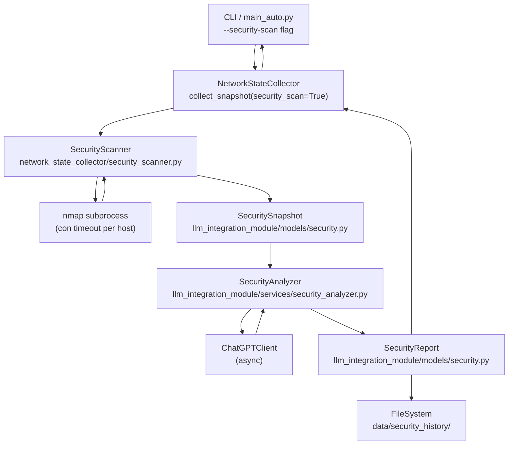

# Documento di Design: collect-security-scan

## Panoramica

Questa feature estende il sistema di monitoraggio SDN aggiungendo una modalità opzionale di
scansione di sicurezza attiva. Quando attivata tramite il flag `--security-scan`, la pipeline
di raccolta esegue scansioni nmap sugli host della rete, costruisce un `SecuritySnapshot` e
lo invia al `ChatGPTClient` per ottenere un `SecurityReport` strutturato con vulnerabilità,
problemi di configurazione e proprietà di sicurezza da verificare.

Il design mantiene la retrocompatibilità totale: il comportamento esistente di `collect_snapshot()`
non viene modificato. La scansione di sicurezza è un percorso opzionale che si innesta dopo la
raccolta standard.

---

## Architettura



### Bridge sync/async

`ChatGPTClient.generate_response()` è una coroutine async. Il resto del sistema
(`NetworkStateCollector`, `SecurityScanner`, `SecurityAnalyzer`) è sincrono.

Il bridge viene gestito in `SecurityAnalyzer.analyze()` tramite `asyncio.run()`:

```python
response = asyncio.run(self.chatgpt_client.generate_response(prompt, system_message=SYSTEM_MSG))
```

Questo è sicuro perché `SecurityAnalyzer.analyze()` viene sempre chiamato da contesto sincrono
(thread del collector). Se in futuro il collector diventasse async, basterà sostituire
`asyncio.run()` con `await`.

---

## Componenti e Interfacce

### SecurityScanner (`network_state_collector/security_scanner.py`)

Responsabile dell'esecuzione di nmap via `subprocess` con timeout configurabile.

```python
class SecurityScanner:
    def __init__(self, timeout: int = 120):
        """
        Args:
            timeout: Timeout in secondi per ciascun host (default 120,
                     override da env SECURITY_SCAN_TIMEOUT)
        """

    def scan(self, ip_addresses: List[str]) -> Dict[str, NmapResult]:
        """
        Esegue nmap su ciascun IP e restituisce i risultati indicizzati per IP.
        Logga il progresso "Scansione X/N: <ip>".
        Non solleva eccezioni per singoli host falliti: li marca come unreachable.

        Raises:
            NmapNotFoundError: se nmap non è installato
        """

    def _scan_host(self, ip: str) -> NmapResult:
        """Scansiona un singolo host con subprocess e timeout."""
```

**Rilevamento IP dalla topologia**: gli IP degli host vengono estratti dal `NetworkSnapshot`
tramite una funzione helper `extract_host_ips(snapshot: NetworkSnapshot) -> List[str]` che
interroga la topologia per trovare gli indirizzi nel range 10.0.0.x.

**Filtraggio per host**: quando l'utente specifica un `Host_Filter` (es. `["h1", "h3"]`),
la funzione helper `resolve_host_filter(host_filter: List[str], snapshot: NetworkSnapshot) -> List[str]`
risolve i nomi Mininet in IP (convenzione `hN` → `10.0.0.N`) e verifica che siano presenti
nella topologia. Gli host non trovati vengono loggati come WARNING e ignorati.

### SecurityAnalyzer (`llm_integration_module/services/security_analyzer.py`)

Costruisce il prompt e chiama `ChatGPTClient`.

```python
class SecurityAnalyzer:
    MAX_TOKENS_ESTIMATE = 12000

    def __init__(self, chatgpt_client: ChatGPTClient):
        ...

    def analyze(self, security_snapshot: SecuritySnapshot) -> SecurityReport:
        """
        Costruisce il prompt, chiama ChatGPTClient (via asyncio.run),
        parsa la risposta JSON e restituisce un SecurityReport.
        """

    def _build_prompt(self, security_snapshot: SecuritySnapshot) -> str:
        """
        Costruisce il prompt. Se supera MAX_TOKENS_ESTIMATE,
        tronca i NmapResult meno rilevanti mantenendo la topologia completa.
        """

    def _parse_response(self, raw: str) -> SecurityReport:
        """
        Parsa il JSON della risposta LLM.
        In caso di JSON non valido, restituisce SecurityReport con liste vuote
        e raw_response popolato.
        """
```

**System message** inviato al `ChatGPTClient`:
```
Sei un esperto di sicurezza di rete. Analizza la topologia SDN e i risultati nmap forniti.
Rispondi ESCLUSIVAMENTE con un JSON valido con questa struttura:
{
  "vulnerabilities": ["..."],
  "configuration_issues": ["..."],
  "security_properties": ["..."]
}
```

### Integrazione in `NetworkStateCollector`

Il metodo `collect_snapshot` riceve un parametro opzionale `security_scan: bool = False` e
un parametro opzionale `host_filter: Optional[List[str]] = None`.
Quando `security_scan=True`, dopo la raccolta standard:

1. Se `host_filter` è `None`, estrae tutti gli IP dalla topologia con `extract_host_ips`
2. Se `host_filter` è fornito, risolve i nomi host con `resolve_host_filter`
3. Istanzia `SecurityScanner` e chiama `scan()` con la lista IP risultante
4. Costruisce `SecuritySnapshot` dal `NetworkSnapshot` + risultati nmap
5. Istanzia `SecurityAnalyzer` e chiama `analyze()`
6. Salva il `SecurityReport` in `data/security_history/`
7. Stampa il report formattato a schermo

```python
def collect_snapshot(
    self,
    security_scan: bool = False,
    host_filter: Optional[List[str]] = None
) -> Optional[NetworkSnapshot]:
    ...
```

---

## Modelli Dati (`llm_integration_module/models/security.py`)

### NmapResult

```python
@dataclass
class OpenPort:
    port: int
    protocol: str        # "tcp" | "udp"
    state: str           # "open" | "filtered" | "closed"
    service: str         # es. "ssh", "http"
    version: str = ""    # versione rilevata, può essere vuota

@dataclass
class NmapResult:
    ip: str
    status: str                      # "scanned" | "unreachable" | "timeout" | "error"
    open_ports: List[OpenPort]
    os_detection: Optional[str]      # OS rilevato, None se non disponibile
    scan_duration_s: float
    error_message: Optional[str] = None

    def to_dict(self) -> Dict[str, Any]: ...

    @classmethod
    def from_dict(cls, data: Dict[str, Any]) -> 'NmapResult': ...
```

### SecuritySnapshot

Estende `NetworkSnapshot` aggiungendo il campo `security_scan`. Non usa ereditarietà
(le dataclass Python non si prestano bene all'ereditarietà con campi default) ma
**composizione**: contiene un `NetworkSnapshot` e aggiunge il campo `security_scan`.

```python
@dataclass
class SecuritySnapshot:
    snapshot: NetworkSnapshot
    security_scan: Dict[str, NmapResult]   # ip -> NmapResult

    def to_dict(self) -> Dict[str, Any]:
        """Merge del dict del NetworkSnapshot con il campo security_scan."""
        d = self.snapshot.to_dict()
        d["security_scan"] = {
            ip: result.to_dict()
            for ip, result in self.security_scan.items()
        }
        return d

    def to_json(self, indent: int = 2) -> str: ...

    @classmethod
    def from_dict(cls, data: Dict[str, Any]) -> 'SecuritySnapshot': ...

    @classmethod
    def from_json(cls, json_str: str) -> 'SecuritySnapshot': ...
```

> Nota sul design: la composizione invece dell'ereditarietà garantisce che tutti i campi
> originali di `NetworkSnapshot` siano preservati invariati (Requisito 2.2) senza rischi
> di shadowing o problemi con `__post_init__`.

### SecurityReport

```python
@dataclass
class SecurityReport:
    vulnerabilities: List[str]
    configuration_issues: List[str]
    security_properties: List[str]
    timestamp: float                        # epoch del report
    snapshot_timestamp: float               # timestamp dello snapshot analizzato
    raw_response: Optional[str] = None      # popolato solo se il parsing JSON fallisce

    def to_dict(self) -> Dict[str, Any]: ...
    def to_json(self, indent: int = 2) -> str: ...

    @classmethod
    def from_dict(cls, data: Dict[str, Any]) -> 'SecurityReport': ...

    @classmethod
    def from_json(cls, json_str: str) -> 'SecurityReport': ...

    def get_timestamp_iso(self) -> str: ...
```

---

## Gestione Errori

| Scenario | Comportamento |
|---|---|
| nmap non installato | `NmapNotFoundError` propagata al caller; snapshot non modificato |
| Timeout singolo host (>timeout s) | `NmapResult(status="timeout")`; log WARNING; continua |
| Errore di rete singolo host | `NmapResult(status="error")`; log WARNING; continua |
| Host non raggiungibile | `NmapResult(status="unreachable", open_ports=[])` |
| Nome host in `Host_Filter` non trovato in topologia | log WARNING; host ignorato; scansione continua |
| Risposta LLM non JSON | `SecurityReport` con liste vuote + `raw_response`; log ERROR |
| Eccezione `ChatGPTClient` | Propagata al caller dopo log ERROR |
| Directory `data/security_history/` assente | Creata automaticamente con `Path.mkdir(parents=True, exist_ok=True)` |
| Prompt > 12000 token stimati | Troncamento `NmapResult` meno rilevanti; topologia sempre inclusa |

### Stima token

La stima dei token viene calcolata con la formula approssimativa:
`token_count ≈ len(text.split()) * 1.3`

I `NmapResult` vengono ordinati per rilevanza decrescente (host con più porte aperte = più
rilevanti) e troncati dal fondo finché la stima rientra nel limite.

---

## Strategia di Testing

### Approccio duale

Il testing combina **unit test** (esempi specifici, casi limite, condizioni di errore) e
**property-based test** (proprietà universali su input generati casualmente).

- Unit test: `pytest`
- Property-based test: `hypothesis` (già presente nel progetto, come evidenziato dalla
  directory `.hypothesis/`)

### Configurazione property test

- Minimo **100 iterazioni** per ogni property test (`@settings(max_examples=100)`)
- Ogni test è annotato con un commento nel formato:
  `# Feature: collect-security-scan, Property N: <testo della proprietà>`

### Unit test

- `test_security_scanner.py`: mock di `subprocess.run`, verifica timeout, verifica
  comportamento con nmap assente, verifica progresso log
- `test_security_analyzer.py`: mock di `ChatGPTClient`, verifica costruzione prompt,
  verifica parsing JSON valido/non valido, verifica troncamento prompt
- `test_security_models.py`: esempi di serializzazione/deserializzazione con valori noti
- `test_collector_integration.py`: verifica che `collect_snapshot(security_scan=False)`
  non istanzi `SecurityScanner`

### Property test

Ogni proprietà del documento viene implementata da un singolo property test con generatori
`hypothesis`. I generatori producono istanze casuali di `NmapResult`, `SecuritySnapshot` e
`SecurityReport` con valori nei domini validi.


---

## Proprietà di Correttezza

*Una proprietà è una caratteristica o comportamento che deve valere per tutte le esecuzioni
valide di un sistema — essenzialmente, un'affermazione formale su ciò che il sistema deve fare.
Le proprietà fungono da ponte tra le specifiche leggibili dall'uomo e le garanzie di correttezza
verificabili automaticamente.*

### Proprietà 1: Copertura degli host target

*Per qualsiasi* topologia di rete e qualsiasi `Host_Filter` (anche vuoto = tutti gli host),
il `SecurityScanner` deve invocare nmap esattamente per gli IP risultanti dalla risoluzione
del filtro e restituire un dizionario con esattamente quelle chiavi.

**Validates: Requirements 1.1, 1.2, 1.7, 1.8**

---

### Proprietà 2: Struttura del NmapResult

*Per qualsiasi* host scansionato con successo (status "scanned"), il `NmapResult` prodotto
deve contenere una lista `open_ports` (anche vuota) dove ogni elemento ha i campi `port`,
`protocol`, `service` e `version`.

**Validates: Requirements 1.3**

---

### Proprietà 3: Resilienza per host falliti

*Per qualsiasi* lista di N host in cui uno o più vanno in timeout o producono un errore di
rete, il `SecurityScanner` deve restituire risultati per tutti gli N host: quelli falliti
con status "timeout" o "error", gli altri con i loro risultati effettivi.

**Validates: Requirements 1.5, 1.6**

---

### Proprietà 4: Invarianza dei campi NetworkSnapshot

*Per qualsiasi* `NetworkSnapshot` e qualsiasi insieme di `NmapResult`, il `SecuritySnapshot`
costruito deve avere `snapshot.timestamp`, `snapshot.topology`, `snapshot.metrics`,
`snapshot.derived_metrics` e `snapshot.metadata` identici ai valori originali del
`NetworkSnapshot`.

**Validates: Requirements 2.2**

---

### Proprietà 5: Round-trip SecuritySnapshot

*Per qualsiasi* `SecuritySnapshot` valido, la serializzazione tramite `to_json()` seguita
dalla deserializzazione tramite `from_json()` deve produrre un oggetto con tutti i campi
identici all'originale, incluso il campo `security_scan` con tutti i suoi `NmapResult`.

**Validates: Requirements 2.4, 2.5**

---

### Proprietà 6: Completezza del prompt

*Per qualsiasi* `SecuritySnapshot`, il prompt costruito da `_build_prompt()` deve contenere
la rappresentazione della topologia (switch e link), le metriche aggregate e gli indirizzi IP
di tutti i `NmapResult` presenti nel `security_scan`.

**Validates: Requirements 3.1**

---

### Proprietà 7: Prompt entro il limite di token

*Per qualsiasi* `SecuritySnapshot`, il prompt costruito da `_build_prompt()` deve avere una
lunghezza stimata in token non superiore a 12000. Se il contenuto grezzo supera il limite,
il troncamento deve preservare sempre la topologia completa.

**Validates: Requirements 3.6**

---

### Proprietà 8: Parsing della risposta LLM valida

*Per qualsiasi* stringa JSON valida con i campi `vulnerabilities`, `configuration_issues` e
`security_properties` (liste di stringhe), `_parse_response()` deve produrre un
`SecurityReport` con quei campi popolati correttamente e `raw_response` pari a `None`.

**Validates: Requirements 3.3**

---

### Proprietà 9: Formato output leggibile

*Per qualsiasi* `SecurityReport`, la funzione di formattazione deve produrre una stringa che
contenga le sottostringhe "Vulnerabilità Potenziali", "Problemi di Configurazione" e
"Proprietà di Sicurezza da Verificare", e che elenchi tutti gli elementi delle rispettive
liste.

**Validates: Requirements 4.3**

---

### Proprietà 10: Round-trip SecurityReport

*Per qualsiasi* `SecurityReport` valido, la serializzazione tramite `to_json()` seguita dalla
deserializzazione tramite `from_json()` deve produrre un oggetto con i campi
`vulnerabilities`, `configuration_issues`, `security_properties`, `timestamp` e
`snapshot_timestamp` identici all'originale.

**Validates: Requirements 5.1, 5.2, 5.3**

---

## Strategia di Testing (dettaglio)

### Libreria property-based

Il progetto usa già **Hypothesis** (directory `.hypothesis/` presente). Tutti i property test
usano `@given` con strategie personalizzate e `@settings(max_examples=100)`.

### Generatori Hypothesis

```python
# Generatore NmapResult
@st.composite
def nmap_results(draw):
    status = draw(st.sampled_from(["scanned", "unreachable", "timeout", "error"]))
    ports = draw(st.lists(open_ports(), max_size=20)) if status == "scanned" else []
    return NmapResult(ip=draw(ip_addresses()), status=status, open_ports=ports, ...)

# Generatore SecuritySnapshot
@st.composite
def security_snapshots(draw):
    snapshot = draw(network_snapshots())
    ips = draw(st.lists(ip_addresses(), min_size=1, max_size=10, unique=True))
    scan = {ip: draw(nmap_results()) for ip in ips}
    return SecuritySnapshot(snapshot=snapshot, security_scan=scan)
```

### Mapping proprietà → test

| Proprietà | Test | Tag |
|---|---|---|
| P1 | `test_scanner_covers_all_hosts` | `# Feature: collect-security-scan, Property 1` |
| P2 | `test_nmap_result_structure` | `# Feature: collect-security-scan, Property 2` |
| P3 | `test_scanner_resilience` | `# Feature: collect-security-scan, Property 3` |
| P4 | `test_security_snapshot_preserves_fields` | `# Feature: collect-security-scan, Property 4` |
| P5 | `test_security_snapshot_roundtrip` | `# Feature: collect-security-scan, Property 5` |
| P6 | `test_prompt_completeness` | `# Feature: collect-security-scan, Property 6` |
| P7 | `test_prompt_token_limit` | `# Feature: collect-security-scan, Property 7` |
| P8 | `test_parse_valid_llm_response` | `# Feature: collect-security-scan, Property 8` |
| P9 | `test_report_format_sections` | `# Feature: collect-security-scan, Property 9` |
| P10 | `test_security_report_roundtrip` | `# Feature: collect-security-scan, Property 10` |

### Unit test (esempi e casi limite)

- **nmap non installato** (edge-case 1.4): mock `subprocess.run` → `FileNotFoundError`; verifica `NmapNotFoundError`
- **host non raggiungibile** (edge-case 2.3): mock nmap output con host down; verifica `status="unreachable"`
- **risposta LLM non JSON** (edge-case 3.4): mock risposta non parsabile; verifica `raw_response` popolato e liste vuote
- **directory assente** (edge-case 5.5): rimuovi `data/security_history/`; verifica creazione automatica
- **system message corretto** (esempio 3.2): verifica che `system_message` passato a `ChatGPTClient` contenga i tre campi JSON
- **eccezione ChatGPTClient propagata** (esempio 3.5): mock che solleva `OpenAIError`; verifica propagazione
- **comportamento senza flag** (esempio 4.1): `collect_snapshot(security_scan=False)`; verifica che `SecurityScanner` non venga istanziato
- **ordinamento operazioni** (esempio 4.2): verifica che snapshot standard preceda la scansione
- **formato log progresso** (esempio 4.4): verifica formato "Scansione X/N: ip"
- **timeout da env var** (esempio 4.5): imposta `SECURITY_SCAN_TIMEOUT=30`; verifica timeout usato
- **salvataggio file** (esempio 5.4): verifica nome file `security_report_{timestamp_iso}.json`
