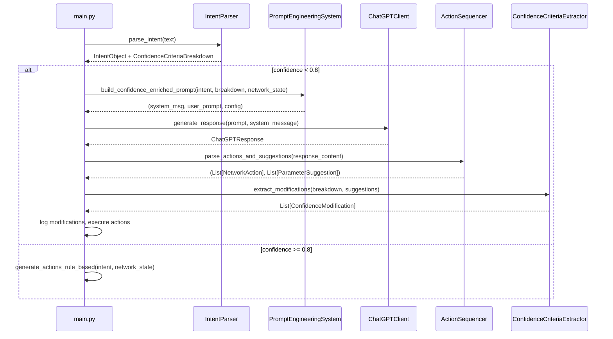

# Design Document: Confidence Criteria Prompt

## Overview

This feature enriches the ChatGPT fallback prompt with the confidence criteria breakdown from `IntentParser._calculate_confidence_enhanced`, so that ChatGPT can return structured parameter suggestions aligned with the scoring algorithm. When the rule-based confidence score falls below `RULE_BASED_CONFIDENCE_THRESHOLD` (0.8), the system currently sends a generic prompt to ChatGPT. This design introduces a criteria-enriched prompt that tells ChatGPT exactly which confidence factors are weak, enabling it to return targeted `parameter_suggestions` that the system can map back to actionable intent modifications.

The flow is:

1. `IntentParser` parses intent and produces a `ConfidenceCriteriaBreakdown` alongside the `IntentObject`.
2. If confidence < 0.8, `PromptEngineeringSystem` builds a `CONFIDENCE_ENRICHED` prompt containing the breakdown.
3. `ChatGPTClient` sends the enriched prompt; the response includes both `actions` and `parameter_suggestions`.
4. `ActionSequencer` parses both arrays from the response.
5. `ConfidenceCriteriaExtractor` maps suggestions to `ConfidenceModification` objects.
6. The main pipeline logs modifications for observability and continues executing actions as before.

## Architecture



The design is additive — no existing interfaces change signature. The `IntentParser` gains a new public method (`get_confidence_breakdown`) and stores breakdown data internally. The `ActionSequencer` gains a new method (`parse_actions_and_suggestions`) that extends the existing `parse_actions_from_response`. The `PromptEngineeringSystem` registers one new template. The `ConfidenceCriteriaExtractor` is a new, standalone service.

## Components and Interfaces

### 1. IntentParser (modified)

**File:** `src/services/intent_parser.py`

New public method:

```python
def get_confidence_breakdown(
    self, intent_obj: IntentObject
) -> ConfidenceCriteriaBreakdown:
    """
    Re-compute and return the confidence criteria breakdown for a parsed intent.
    Uses the same logic as _calculate_confidence_enhanced but returns
    individual factor values instead of a single float.
    """
```

Internally, `_calculate_confidence_enhanced` already computes `base_confidence`, `entity_boost`, `type_boost`, `token_boost`, `quality_boost`, and `penalties`. The new method exposes these as a `ConfidenceCriteriaBreakdown` object. It also includes `entities_detail` (list of entity name/type/confidence dicts) and `intent_type_detail` (dict with type and classification confidence).

### 2. PromptEngineeringSystem (modified)

**File:** `src/services/prompt_engineering.py`

New enum value:

```python
class PromptType(str, Enum):
    # ... existing values ...
    CONFIDENCE_ENRICHED = "confidence_enriched"
```

New template registered in `_initialize_templates()` with placeholders: `{intent_text}`, `{network_state_summary}`, `{confidence_criteria_breakdown}`, `{response_schema}`.

New builder method:

```python
def build_confidence_enriched_prompt(
    self,
    intent: IntentObject,
    breakdown: ConfidenceCriteriaBreakdown,
    network_state: NetworkState
) -> Tuple[str, str, Dict[str, Any]]:
    """Build a criteria-enriched prompt for ChatGPT fallback."""
```

### 3. ActionSequencer (modified)

**File:** `src/services/action_sequencer.py`

New method:

```python
def parse_actions_and_suggestions(
    self, response_content: str
) -> Tuple[List[NetworkAction], List[ParameterSuggestion]]:
    """
    Parse both the actions array and parameter_suggestions array
    from a ChatGPT response to a confidence-enriched prompt.
    Falls back gracefully if parameter_suggestions is missing/malformed.
    """
```

This method reuses the existing JSON extraction logic from `parse_actions_from_response` and adds parsing for the `parameter_suggestions` key. Each suggestion is validated against known confidence factors.

### 4. ConfidenceCriteriaExtractor (new)

**File:** `src/services/confidence_criteria_extractor.py`

```python
class ConfidenceCriteriaExtractor:
    """Maps ChatGPT parameter suggestions to actionable confidence modifications."""

    VALID_FACTORS = {
        "base_confidence", "entity_boost", "type_boost",
        "token_boost", "quality_boost"
    }

    def extract_modifications(
        self,
        breakdown: ConfidenceCriteriaBreakdown,
        suggestions: List[ParameterSuggestion]
    ) -> List[ConfidenceModification]:
        """
        Produce a list of recommended modifications from parameter suggestions.
        Discards suggestions targeting unknown factors with a warning log.
        """
```

### 5. Main Pipeline (modified)

**File:** `main.py`

In the `not use_rule_based` branch, replace the current generic prompt construction with:

1. Call `intent_parser.get_confidence_breakdown(intent_obj)` to get the breakdown.
2. Call `prompt_system.build_confidence_enriched_prompt(intent_obj, breakdown, network_state)` to get the enriched prompt.
3. After receiving the ChatGPT response, call `action_sequencer.parse_actions_and_suggestions(response.content)`.
4. If suggestions are present, call `extractor.extract_modifications(breakdown, suggestions)` and log the results.
5. Continue with action sequencing/validation/execution as before.

## Data Models

**File:** `src/models/confidence.py`

```python
from pydantic import BaseModel, Field, validator
from typing import Any, Dict, List, Optional


class ConfidenceCriteriaBreakdown(BaseModel):
    """Breakdown of confidence scoring factors."""
    base_confidence: float = Field(ge=0.0, le=1.0)
    entity_boost: float = Field(ge=0.0, le=1.0)
    type_boost: float = Field(ge=0.0, le=1.0)
    token_boost: float = Field(ge=0.0, le=1.0)
    quality_boost: float = Field(ge=0.0, le=1.0)
    penalties: float = Field(ge=0.0, le=1.0)
    final_score: float = Field(ge=0.0, le=1.0)
    entities_detail: List[Dict[str, Any]] = Field(default_factory=list)
    intent_type_detail: Dict[str, Any] = Field(default_factory=dict)

    @validator('final_score')
    def validate_final_score(cls, v, values):
        """Validate final_score equals sum of contributions minus penalties, clamped."""
        contributions = (
            values.get('base_confidence', 0)
            + values.get('entity_boost', 0)
            + values.get('type_boost', 0)
            + values.get('token_boost', 0)
            + values.get('quality_boost', 0)
        )
        expected = max(0.1, min(1.0, contributions - values.get('penalties', 0)))
        if abs(v - expected) > 0.01:
            raise ValueError(
                f"final_score {v} does not match computed value {expected}"
            )
        return v


class ParameterSuggestion(BaseModel):
    """A suggestion from ChatGPT for improving confidence."""
    target_factor: str
    suggested_parameter: str
    suggested_value: str
    estimated_improvement: float = Field(ge=0.0, le=1.0)
    reasoning: str = ""


class ConfidenceModification(BaseModel):
    """A recommended modification to the IntentObject."""
    target_field: str  # "entities", "parameters", or "raw_text"
    current_value: Any = None
    suggested_value: Any = None
    estimated_new_score: float = Field(ge=0.0, le=1.0)
    source_suggestion: ParameterSuggestion
```


## Correctness Properties

*A property is a characteristic or behavior that should hold true across all valid executions of a system — essentially, a formal statement about what the system should do. Properties serve as the bridge between human-readable specifications and machine-verifiable correctness guarantees.*

### Property 1: Breakdown completeness

*For any* valid intent text, calling `get_confidence_breakdown` after parsing should return a `ConfidenceCriteriaBreakdown` where all float fields (`base_confidence`, `entity_boost`, `type_boost`, `token_boost`, `quality_boost`, `penalties`, `final_score`) are present and within the range [0.0, 1.0].

**Validates: Requirements 1.1, 1.2**

### Property 2: Breakdown detail consistency

*For any* valid intent text that produces at least one entity, the `ConfidenceCriteriaBreakdown.entities_detail` list should have the same length as the `IntentObject.entities` list, each entry containing `name`, `type`, and `confidence` keys; and `intent_type_detail` should contain a `type` field matching `IntentObject.intent_type` and a `confidence` float.

**Validates: Requirements 1.3, 1.4**

### Property 3: Enriched prompt contains all criteria factors

*For any* `ConfidenceCriteriaBreakdown`, the prompt string produced by `build_confidence_enriched_prompt` should contain string representations of all six factor names (`base_confidence`, `entity_boost`, `type_boost`, `token_boost`, `quality_boost`, `penalties`) and their corresponding numeric values.

**Validates: Requirements 2.1, 2.2**

### Property 4: Actions and suggestions parsing round-trip

*For any* valid JSON string containing an `actions` array of valid action objects and a `parameter_suggestions` array of valid suggestion objects, `parse_actions_and_suggestions` should return a tuple where the first list has the same length as the input `actions` array and the second list has the same length as the input `parameter_suggestions` array.

**Validates: Requirements 3.1, 3.4**

### Property 5: Suggestion factor validation and filtering

*For any* `ParameterSuggestion`, if its `target_factor` is in the known set `{base_confidence, entity_boost, type_boost, token_boost, quality_boost}`, the `ConfidenceCriteriaExtractor` should produce a `ConfidenceModification` for it; if the `target_factor` is not in the known set, the extractor should discard it and produce no modification for that suggestion.

**Validates: Requirements 3.2, 4.5**

### Property 6: Factor-to-field mapping

*For any* valid `ParameterSuggestion` with `target_factor="entity_boost"`, the resulting `ConfidenceModification.target_field` should be `"entities"`; for `target_factor="type_boost"`, the `target_field` should be `"parameters"`.

**Validates: Requirements 4.3, 4.4**

### Property 7: ConfidenceCriteriaBreakdown validation constraint

*For any* set of float values for `base_confidence`, `entity_boost`, `type_boost`, `token_boost`, `quality_boost`, and `penalties` (each in [0.0, 1.0]), constructing a `ConfidenceCriteriaBreakdown` should succeed only when `final_score` equals `max(0.1, min(1.0, sum_of_contributions - penalties))` (within tolerance of 0.01). Invalid `final_score` values should raise a validation error.

**Validates: Requirements 6.1, 6.2, 6.3, 6.4**

## Error Handling

| Scenario | Handling |
|---|---|
| `get_confidence_breakdown` called with an intent that has no entities | Return breakdown with `entities_detail=[]` and `entity_boost=0.0`. No error. |
| `parameter_suggestions` missing from ChatGPT response | `parse_actions_and_suggestions` logs a warning and returns `(actions, [])`. |
| `parameter_suggestions` is malformed (not a list, or entries missing fields) | Log warning, skip malformed entries, return valid suggestions only. |
| `ParameterSuggestion.target_factor` is unknown | `ConfidenceCriteriaExtractor` discards the suggestion and logs a warning. |
| ChatGPT response is not valid JSON | Existing error handling in `parse_actions_from_response` applies — returns empty lists. |
| `ConfidenceCriteriaBreakdown` constructed with inconsistent `final_score` | Pydantic validator raises `ValueError`. |
| `estimated_improvement` or `estimated_new_score` out of [0.0, 1.0] | Pydantic `Field(ge=0.0, le=1.0)` raises validation error at construction time. |

## Testing Strategy

### Unit Tests (example-based)

- Template registration: verify `PromptType.CONFIDENCE_ENRICHED` is registered and the template contains the four required placeholders (`intent_text`, `network_state_summary`, `confidence_criteria_breakdown`, `response_schema`).
- Template system message: verify it mentions SDN expertise and parameter suggestions.
- Template response schema: verify it contains both `actions` and `parameter_suggestions` keys.
- Extractor method signature: verify `extract_modifications` accepts `ConfidenceCriteriaBreakdown` and `List[ParameterSuggestion]`.
- Edge case: `parse_actions_and_suggestions` with response missing `parameter_suggestions` returns actions and empty list.
- Edge case: `parse_actions_and_suggestions` with completely invalid JSON returns two empty lists.
- Integration: main pipeline calls `build_confidence_enriched_prompt` when confidence < 0.8.
- Integration: main pipeline still executes actions when no parameter suggestions are present.

### Property-Based Tests (Hypothesis)

Each property from the Correctness Properties section above is implemented as a single Hypothesis test with a minimum of 100 iterations. The PBT library is **Hypothesis** (already in use in this project, as evidenced by the `.hypothesis` directory).

Each test is tagged with a comment:
```
# Feature: confidence-criteria-prompt, Property N: <property text>
```

Generators needed:
- **Intent text generator**: random strings combining action words, resource identifiers (sw1, h2), target words (flow, slice), and technical terms.
- **ConfidenceCriteriaBreakdown generator**: random floats in [0.0, 1.0] for each factor, with `final_score` computed as `max(0.1, min(1.0, sum - penalties))`.
- **ParameterSuggestion generator**: random `target_factor` from both valid and invalid values, random strings for parameter/value, random float for improvement.
- **JSON response generator**: random valid action dicts and suggestion dicts serialized to JSON.
