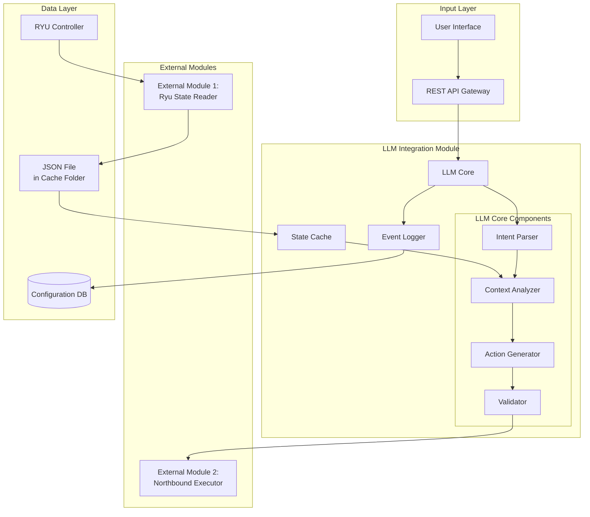

# Design Document

## Overview

Il modulo di integrazione LLM è progettato come un servizio middleware che funge da ponte intelligente tra gli intent degli utenti espressi in linguaggio naturale e le azioni concrete di configurazione di rete. Il modulo utilizza ChatGPT API (OpenAI) per interpretare intent complessi, analizzare lo stato della rete letto da file JSON in cache, e generare sequenze di azioni validate.

L'architettura è basata su un pattern modulare con separazione chiara delle responsabilità. Un modulo esterno si occupa di connettersi al controller Ryu e salvare lo stato della rete come file JSON nella cartella cache. Il modulo LLM legge e analizza questo file JSON per ottenere lo stato corrente della rete. Le azioni generate vengono salvate in formato strutturato (JSON/file) pronte per la futura integrazione con il modulo Northbound che applicherà le modifiche alla rete. Il modulo mantiene una rappresentazione interna dello stato della rete e utilizza tecniche di prompt engineering ottimizzate per il dominio networking. L'utilizzo esclusivo di ChatGPT API semplifica l'implementazione, migliora la velocità di risposta e garantisce accuratezza superiore nell'interpretazione degli intent.

**Nota**: Il sistema è progettato per esecuzione locale con l'unico collegamento esterno tramite internet all'API di ChatGPT. Il modulo Northbound per l'esecuzione delle azioni verrà integrato in futuro.

## Architecture

Il sistema segue un'architettura modulare con separazione chiara delle responsabilità:



### Communication Flow

1. **State Collection** (External Module 1): Un modulo esterno si connette al controller Ryu, legge lo stato della rete e lo salva come file JSON nella cartella cache
2. **Intent Reception**: Gli intent arrivano tramite REST API o interfaccia web al modulo LLM
3. **State Loading**: Il modulo LLM legge il file JSON dalla cache per ottenere lo stato corrente della rete
4. **Intent Processing**: Il LLM analizza l'intent nel contesto dello stato caricato
5. **Action Generation**: Vengono generate azioni strutturate e validate
6. **Action Output**: Le azioni vengono salvate in formato strutturato (JSON/file) per futura integrazione con il modulo Northbound
7. **Future Execution** (External Module 2 - da integrare): Il modulo Northbound applicherà le azioni alla rete
8. **Logging**: Tutte le operazioni vengono registrate per tracciabilità e debugging

**Nota**: Il modulo Northbound (External Module 2) verrà integrato in futuro. Per ora, il sistema genera e valida le azioni, salvandole in formato strutturato pronto per l'integrazione futura.

## Components and Interfaces

### ChatGPT API Interface
**Responsabilità**: Comunicazione con ChatGPT API per generazione risposte
- **Input**: Prompt strutturato con contesto di rete
- **Output**: Risposta ChatGPT parsata e validata
- **Interfacce**:
  - `generateResponse(prompt: str, context: dict) -> ChatGPTResponse`
  - `isAvailable() -> bool`
  - `getLatency() -> float`
  - `getRateLimitStatus() -> RateLimitInfo`

**Configurazione**:
- **Modelli supportati**: GPT-4, GPT-4-turbo, GPT-3.5-turbo
- **Modello raccomandato**: GPT-4-turbo per bilanciamento qualità/velocità/costo
- **Context window**: Fino a 128k token (GPT-4-turbo)
- **Rate limiting**: Gestione automatica con retry e backoff esponenziale
- **Costi stimati**: ~$0.01-0.03 per 1K token (dipende dal modello)
- **Timeout**: 30 secondi default, configurabile
- **Retry logic**: Max 3 tentativi con backoff esponenziale

### Intent Parser
**Responsabilità**: Preprocessing e normalizzazione degli intent in linguaggio naturale
- **Input**: Raw text intent da utenti
- **Output**: Structured intent object con entità estratte
- **Interfacce**:
  - `parseIntent(text: string) -> IntentObject`
  - `extractEntities(intent: IntentObject) -> EntityList`
  - `validateSyntax(intent: IntentObject) -> ValidationResult`

### Context Analyzer  
**Responsabilità**: Analisi dello stato della rete e correlazione con gli intent
- **Input**: IntentObject + NetworkState da cache
- **Output**: ContextualizedIntent con informazioni di rete rilevanti
- **Interfacce**:
  - `analyzeContext(intent: IntentObject, state: NetworkState) -> ContextualizedIntent`
  - `identifyRelevantResources(intent: IntentObject) -> ResourceList`
  - `detectConflicts(intent: IntentObject, state: NetworkState) -> ConflictList`

### Action Generator
**Responsabilità**: Generazione di azioni di rete concrete tramite ChatGPT API
- **Input**: ContextualizedIntent
- **Output**: ActionSequence con comandi strutturati
- **Interfacce**:
  - `generateActions(contextIntent: ContextualizedIntent) -> ActionSequence`
  - `optimizeSequence(actions: ActionSequence) -> ActionSequence`
  - `estimateImpact(actions: ActionSequence) -> ImpactAssessment`

### Validator
**Responsabilità**: Validazione e verifica della sicurezza delle azioni generate
- **Input**: ActionSequence
- **Output**: ValidatedActions o ErrorReport
- **Interfacce**:
  - `validateActions(actions: ActionSequence) -> ValidationResult`
  - `checkSafety(actions: ActionSequence) -> SafetyReport`
  - `simulateExecution(actions: ActionSequence) -> SimulationResult`

### External Module Interface
**Responsabilità**: Output delle azioni validate per futura integrazione con modulo Northbound
- **Input**: ValidatedActions
- **Output**: Structured output (JSON/file) per future integration
- **Interfacce**:
  - `outputActions(actions: ValidatedActions) -> OutputResult`
  - `serializeActions(actions: ValidatedActions) -> string`
  - `saveActionsToFile(actions: ValidatedActions, path: string) -> bool`

**Nota**: Questa interfaccia è progettata per facilitare la futura integrazione con il modulo Northbound che verrà sviluppato successivamente.

### State Cache
**Responsabilità**: Lettura e mantenimento dello stato della rete da file JSON in cache
- **Input**: Path al file JSON nella cartella cache
- **Output**: Current NetworkState per Context Analyzer
- **Interfacce**:
  - `loadStateFromFile(filePath: string) -> NetworkState`
  - `getCurrentState() -> NetworkState`
  - `getStateAge() -> number` (secondi dall'ultimo caricamento)
  - `refreshState() -> NetworkState` (ricarica il file JSON)
  - `isStateStale(maxAge: number) -> bool` (verifica se lo stato è troppo vecchio)

## Data Models

### Cache Configuration
```typescript
interface CacheConfig {
  cacheFolder: string;           // Path alla cartella cache (es. "./cache")
  stateFileName: string;          // Nome del file JSON (es. "network_state.json")
  maxStateAge: number;            // Età massima dello stato in secondi prima di considerarlo stale
  refreshInterval: number;        // Intervallo di refresh automatico in secondi (opzionale)
  watchFile: boolean;             // Se true, monitora il file per cambiamenti automatici
}
```

### JSON File Format
Il file JSON nella cache deve seguire questo formato:
```json
{
  "timestamp": "2024-01-15T10:30:00Z",
  "topology": {
    "switches": [...],
    "links": [...],
    "hosts": [...]
  },
  "flows": [...],
  "slices": [...],
  "metrics": {
    "bandwidth": {...},
    "latency": {...},
    "utilization": {...}
  },
  "anomalies": [...]
}
```

### IntentObject
```typescript
interface IntentObject {
  id: string;
  rawText: string;
  timestamp: Date;
  userId: string;
  entities: EntityList;
  intentType: 'configuration' | 'query' | 'anomaly_response';
  confidence: number;
  parameters: Map<string, any>;
}
```

### NetworkState
```typescript
interface NetworkState {
  timestamp: Date;
  topology: {
    switches: Switch[];
    links: Link[];
    hosts: Host[];
  };
  flows: Flow[];
  slices: NetworkSlice[];
  metrics: {
    bandwidth: BandwidthMetrics;
    latency: LatencyMetrics;
    utilization: UtilizationMetrics;
  };
  anomalies: Anomaly[];
}
```

### ActionSequence
```typescript
interface ActionSequence {
  id: string;
  intentId: string;
  actions: NetworkAction[];
  estimatedDuration: number;
  dependencies: string[];
  rollbackPlan: NetworkAction[];
}

interface NetworkAction {
  type: 'flow_mod' | 'slice_create' | 'slice_modify' | 'config_change';
  target: string;
  parameters: Map<string, any>;
  priority: number;
  timeout: number;
}
```

### NetworkSlice
```typescript
interface NetworkSlice {
  id: string;
  name: string;
  resources: {
    bandwidth: number;
    switches: string[];
    paths: Path[];
  };
  policies: Policy[];
  sla: ServiceLevelAgreement;
  status: 'active' | 'inactive' | 'configuring' | 'error';
}
```

### ChatGPT Configuration Model
```typescript
interface ChatGPTConfig {
  apiKey: string;
  model: 'gpt-4' | 'gpt-4-turbo' | 'gpt-3.5-turbo';
  maxTokens: number;
  temperature: number;
  rateLimitRpm: number;
  timeout: number;
  maxRetries: number;
}

interface ChatGPTResponse {
  content: string;
  model: string;
  tokensUsed: number;
  latency: number;
  finishReason: string;
}

interface RateLimitInfo {
  remainingRequests: number;
  resetTime: Date;
  isThrottled: boolean;
}
```

## Correctness Properties

*A property is a characteristic or behavior that should hold true across all valid executions of a system-essentially, a formal statement about what the system should do. Properties serve as the bridge between human-readable specifications and machine-verifiable correctness guarantees.*

### Property Reflection

Dopo aver analizzato tutti i criteri di accettazione, ho identificato alcune proprietà che possono essere consolidate per eliminare ridondanza:

- Le proprietà 2.1 e 2.4 possono essere combinate in una proprietà più comprensiva sulla gestione dello stato
- Le proprietà 3.1 e 3.3 possono essere unificate in una proprietà sulla validazione e formattazione delle azioni
- Le proprietà 4.1 e 4.2 possono essere combinate in una proprietà comprensiva sul rilevamento anomalie

### Core Properties

**Property 1: Intent parsing completeness**
*For any* natural language intent provided by a user, the LLM_Module should successfully parse it into a valid IntentObject with correctly extracted entities and appropriate confidence scores
**Validates: Requirements 1.1**

**Property 2: Resource validation consistency**
*For any* intent containing references to network resources, the validation result should correctly reflect the actual existence of those resources in the current NetworkState
**Validates: Requirements 1.2**

**Property 3: Clarification request appropriateness**
*For any* ambiguous or incomplete intent, the LLM_Module should generate specific clarification requests that address the missing or unclear information
**Validates: Requirements 1.3**

**Property 4: Action generation completeness**
*For any* valid and complete intent, the generated NetworkActions should be sufficient to fully implement the intent's requirements
**Validates: Requirements 1.4**

**Property 5: State data freshness**
*For any* intent processing operation, the LLM_Module should load the most recent NetworkState data from the JSON file in cache and request a refresh when data exceeds the configured age threshold
**Validates: Requirements 1.5, 2.3, 2.4**

**Property 6: State file reading reliability**
*For any* JSON file read operation, the LLM_Module should correctly parse valid JSON data and properly handle corrupted or malformed files with appropriate error signaling
**Validates: Requirements 2.1, 2.2**

**Property 7: Dynamic state adaptation**
*For any* significant change in NetworkState, active intents should be automatically re-evaluated and updated as necessary
**Validates: Requirements 2.5**

**Property 8: Action validation and formatting**
*For any* generated NetworkAction sequence, all actions should be syntactically and semantically valid and formatted according to the external module's interface specification
**Validates: Requirements 3.1, 3.3**

**Property 9: Conflict detection accuracy**
*For any* NetworkAction sequence that could cause conflicts or problems, the LLM_Module should identify and report all potential risks before execution
**Validates: Requirements 3.2**

**Property 10: Action sequencing logic**
*For any* intent requiring multiple NetworkActions, the actions should be ordered in a logical execution sequence that respects dependencies and minimizes conflicts
**Validates: Requirements 3.4**

**Property 11: Action traceability**
*For any* NetworkAction sent to the external execution module, a complete log entry should be created and maintained for audit and debugging purposes
**Validates: Requirements 3.5**

**Property 12: Anomaly detection comprehensiveness**
*For any* NetworkState containing known anomalous patterns, the LLM_Module should correctly identify, classify, and assess the severity of all anomalies
**Validates: Requirements 4.1, 4.2**

**Property 13: Automatic anomaly mitigation**
*For any* critical anomaly detected, appropriate NetworkActions should be automatically generated to mitigate the problem without human intervention
**Validates: Requirements 4.3**

**Property 14: Anomaly notification completeness**
*For any* detected anomaly, administrators should receive notifications containing all relevant details for assessment and response
**Validates: Requirements 4.4**

**Property 15: Learning system improvement**
*For any* false positive in anomaly detection, the feedback mechanism should contribute to improved accuracy in future detections
**Validates: Requirements 4.5**

**Property 16: Slice configuration completeness**
*For any* intent requesting NetworkSlice creation, all necessary component configurations should be generated to fully implement the slice requirements
**Validates: Requirements 5.1**

**Property 17: Service continuity preservation**
*For any* modification to an existing NetworkSlice, the changes should be implemented without interrupting ongoing services
**Validates: Requirements 5.2**

**Property 18: Resource allocation fairness**
*For any* scenario where multiple NetworkSlices compete for the same resources, the allocation should follow configured priority and fairness policies
**Validates: Requirements 5.3**

**Property 19: Resource cleanup completeness**
*For any* NetworkSlice that is no longer needed, all associated resources should be properly released and made available for reallocation
**Validates: Requirements 5.4**

**Property 20: Dependency update consistency**
*For any* change in NetworkSlice state, all dependent configurations should be automatically updated to maintain system consistency
**Validates: Requirements 5.5**

**Property 21: File system resilience**
*For any* file reading error when accessing the JSON cache file, the retry mechanism should implement exponential backoff and eventually succeed or fail gracefully with appropriate error reporting
**Validates: Requirements 6.1**

**Property 22: API resilience**
*For any* situation where ChatGPT API is temporarily unavailable or rate-limited, the system should implement retry logic and eventually operate in degraded mode while maintaining essential functionality
**Validates: Requirements 6.1, 6.2**

**Property 23: Input sanitization security**
*For any* malformed or potentially malicious input, the sanitization process should neutralize threats while preserving legitimate functionality
**Validates: Requirements 6.3**

**Property 24: Error handling completeness**
*For any* critical error, comprehensive logging and administrator notification should occur to enable rapid diagnosis and resolution
**Validates: Requirements 6.4**

**Property 25: State recovery reliability**
*For any* system restart after an error, the previous operational state should be fully recovered without data loss
**Validates: Requirements 6.5**

## ChatGPT API Integration Strategy

Il sistema utilizza esclusivamente ChatGPT API per tutte le operazioni di interpretazione intent e generazione azioni.

### Model Selection

**GPT-4-turbo (Raccomandato)**:
- Bilanciamento ottimale tra qualità, velocità e costo
- Context window: 128k token
- Latenza: ~2-5 secondi per richieste complesse
- Costo: ~$0.01 per 1K input token, ~$0.03 per 1K output token
- Ideale per: Tutti i casi d'uso del sistema

**GPT-4**:
- Massima qualità e accuratezza
- Context window: 8k-32k token (dipende dalla versione)
- Latenza: ~5-10 secondi
- Costo: ~$0.03 per 1K input token, ~$0.06 per 1K output token
- Ideale per: Operazioni critiche che richiedono massima precisione

**GPT-3.5-turbo**:
- Velocità massima, costo minimo
- Context window: 16k token
- Latenza: ~1-2 secondi
- Costo: ~$0.0005 per 1K input token, ~$0.0015 per 1K output token
- Ideale per: Operazioni semplici e validazioni rapide (se necessario ridurre costi)

### Prompt Engineering

Il sistema utilizza prompt ottimizzati per il dominio networking:

```python
def build_prompt(intent: IntentObject, network_state: NetworkState) -> str:
    return f"""
You are a network configuration expert. Analyze the following network intent and current state, 
then generate appropriate network actions.

Network Intent: {intent.rawText}
Current Network State:
- Topology: {network_state.topology}
- Active Flows: {network_state.flows}
- Network Slices: {network_state.slices}

Generate a JSON response with:
1. Interpreted intent
2. Required network actions
3. Potential conflicts or risks
4. Execution sequence

Response format: {ACTION_SCHEMA}
"""
```

### Rate Limiting and Cost Management

- **Rate Limits**: Rispetto automatico dei limiti API OpenAI
- **Request Batching**: Aggregazione richieste quando possibile
- **Caching**: Cache delle risposte per intent simili
- **Cost Tracking**: Monitoraggio continuo dei costi per ottimizzazione
- **Budget Alerts**: Notifiche quando si avvicinano soglie di costo

## Error Handling

Il sistema implementa una strategia di error handling a più livelli:

### Input Validation Errors
- **Malformed Intents**: Sanitizzazione e richiesta di chiarimenti
- **Invalid Network References**: Validazione contro stato corrente e suggerimenti alternativi
- **Authentication Failures**: Logging sicuro e notifica amministratori

### Processing Errors  
- **ChatGPT API Failures**: 
  - Retry automatico con backoff esponenziale (max 3 tentativi)
  - Modalità degradata con regole predefinite se API non disponibile
  - Notifica amministratori per outage prolungati
- **Rate Limiting**: Gestione automatica con queue e retry scheduling
- **Context Analysis Errors**: Utilizzo di stato cached o richiesta aggiornamenti
- **Action Generation Failures**: Retry con parametri semplificati (temperatura ridotta, prompt più semplici)

### Communication Errors
- **JSON File Reading Issues**: Retry con backoff esponenziale, max 5 tentativi
- **File Not Found**: Attesa e retry periodico, notifica se il file non viene creato entro timeout
- **Malformed JSON**: Logging dettagliato dell'errore, notifica amministratori, attesa per file aggiornato
- **External Module Communication Failures**: Retry con backoff esponenziale, queue delle azioni in attesa
- **Database Errors**: Transazioni atomiche e recovery automatico

### System Errors
- **Memory/Resource Exhaustion**: Garbage collection forzata e limitazione carico
- **Configuration Errors**: Validazione all'avvio e fallback a configurazioni default
- **Security Breaches**: Isolamento immediato e notifica security team

## Testing Strategy

### Dual Testing Approach

Il sistema utilizza sia unit testing che property-based testing per garantire copertura completa:

**Unit Testing**:
- Test di integrazione tra componenti
- Scenari specifici di edge cases
- Validazione di esempi concreti di intent e azioni
- Test di error handling per situazioni specifiche

**Property-Based Testing**:
- Utilizzo di **Hypothesis** (Python) per property-based testing
- Ogni test property-based configurato per minimo **100 iterazioni**
- Ogni property-based test taggato con formato: **Feature: llm-integration-module, Property {number}: {property_text}**
- Generatori intelligenti per:
  - Intent in linguaggio naturale con varie complessità
  - Stati di rete con topologie diverse
  - Sequenze di azioni con dipendenze complesse
  - Scenari di anomalie e errori
  - Risposte ChatGPT simulate per testing offline

**Test Data Generation**:
- **Intent Generator**: Crea intent naturali con entità, ambiguità e complessità variabili
- **NetworkState Generator**: Genera topologie di rete realistiche con metriche e anomalie
- **Action Sequence Generator**: Produce sequenze di azioni con dipendenze e conflitti
- **Error Scenario Generator**: Simula vari tipi di errori e condizioni di failure

**Integration Testing**:
- Test end-to-end con file JSON simulati
- Test di carico con multiple richieste concorrenti  
- Test di resilienza con injection di errori (file corrotti, file mancanti)
- Test di performance con grandi stati di rete
- Test di file watching e refresh automatico dello stato
- **Test di rate limiting**: Simulazione limiti API e gestione throttling
- **Test di costo**: Monitoraggio utilizzo token e ottimizzazione costi

**Continuous Testing**:
- Pipeline CI/CD con test automatici
- Monitoring di regressioni nelle performance
- Test di compatibilità con diversi formati JSON
- Validazione continua delle proprietà di correttezza
- **Cost tracking**: Monitoraggio costi ChatGPT API in ambiente di test
- **Mock API**: Utilizzo di mock ChatGPT per test rapidi senza costi