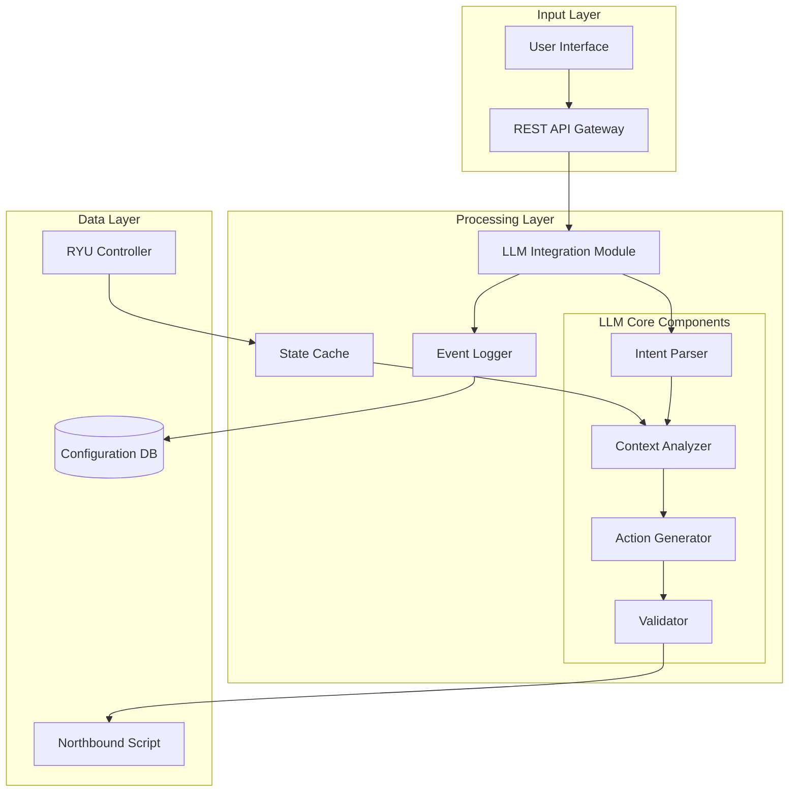

# Design Document

## Overview

Il modulo di integrazione LLM è progettato come un servizio middleware che funge da ponte intelligente tra gli intent degli utenti espressi in linguaggio naturale e le azioni concrete di configurazione di rete. Il modulo utilizza un Large Language Model per interpretare intent complessi, analizzare lo stato della rete fornito da RYU, e generare sequenze di azioni validate che vengono poi eseguite dal Northbound script.

L'architettura è basata su un pattern di microservizi con comunicazione asincrona, garantendo scalabilità e resilienza. Il modulo mantiene una rappresentazione interna dello stato della rete e utilizza tecniche di prompt engineering e fine-tuning per ottimizzare le performance del modello LLM per il dominio networking.

## Architecture

Il sistema segue un'architettura a tre livelli:



### Communication Flow

1. **Intent Reception**: Gli intent arrivano tramite REST API o interfaccia web
2. **State Synchronization**: Il modulo riceve aggiornamenti periodici da RYU
3. **Intent Processing**: Il LLM analizza l'intent nel contesto dello stato corrente
4. **Action Generation**: Vengono generate azioni strutturate e validate
5. **Execution**: Le azioni vengono inviate al Northbound script per l'esecuzione
6. **Feedback Loop**: I risultati vengono monitorati e utilizzati per migliorare future decisioni

## Components and Interfaces

### Intent Parser
**Responsabilità**: Preprocessing e normalizzazione degli intent in linguaggio naturale
- **Input**: Raw text intent da utenti
- **Output**: Structured intent object con entità estratte
- **Interfacce**:
  - `parseIntent(text: string) -> IntentObject`
  - `extractEntities(intent: IntentObject) -> EntityList`
  - `validateSyntax(intent: IntentObject) -> ValidationResult`

### Context Analyzer  
**Responsabilità**: Analisi dello stato della rete e correlazione con gli intent
- **Input**: IntentObject + NetworkState da cache
- **Output**: ContextualizedIntent con informazioni di rete rilevanti
- **Interfacce**:
  - `analyzeContext(intent: IntentObject, state: NetworkState) -> ContextualizedIntent`
  - `identifyRelevantResources(intent: IntentObject) -> ResourceList`
  - `detectConflicts(intent: IntentObject, state: NetworkState) -> ConflictList`

### Action Generator
**Responsabilità**: Generazione di azioni di rete concrete tramite LLM
- **Input**: ContextualizedIntent
- **Output**: ActionSequence con comandi strutturati
- **Interfacce**:
  - `generateActions(contextIntent: ContextualizedIntent) -> ActionSequence`
  - `optimizeSequence(actions: ActionSequence) -> ActionSequence`
  - `estimateImpact(actions: ActionSequence) -> ImpactAssessment`

### Validator
**Responsabilità**: Validazione e verifica della sicurezza delle azioni generate
- **Input**: ActionSequence
- **Output**: ValidatedActions o ErrorReport
- **Interfacce**:
  - `validateActions(actions: ActionSequence) -> ValidationResult`
  - `checkSafety(actions: ActionSequence) -> SafetyReport`
  - `simulateExecution(actions: ActionSequence) -> SimulationResult`

### State Cache
**Responsabilità**: Mantenimento di una rappresentazione aggiornata dello stato della rete
- **Input**: NetworkState updates da RYU
- **Output**: Current NetworkState per Context Analyzer
- **Interfacce**:
  - `updateState(newState: NetworkState) -> void`
  - `getCurrentState() -> NetworkState`
  - `getHistoricalState(timestamp: Date) -> NetworkState`

## Data Models

### IntentObject
```typescript
interface IntentObject {
  id: string;
  rawText: string;
  timestamp: Date;
  userId: string;
  entities: EntityList;
  intentType: 'configuration' | 'query' | 'anomaly_response';
  confidence: number;
  parameters: Map<string, any>;
}
```

### NetworkState
```typescript
interface NetworkState {
  timestamp: Date;
  topology: {
    switches: Switch[];
    links: Link[];
    hosts: Host[];
  };
  flows: Flow[];
  slices: NetworkSlice[];
  metrics: {
    bandwidth: BandwidthMetrics;
    latency: LatencyMetrics;
    utilization: UtilizationMetrics;
  };
  anomalies: Anomaly[];
}
```

### ActionSequence
```typescript
interface ActionSequence {
  id: string;
  intentId: string;
  actions: NetworkAction[];
  estimatedDuration: number;
  dependencies: string[];
  rollbackPlan: NetworkAction[];
}

interface NetworkAction {
  type: 'flow_mod' | 'slice_create' | 'slice_modify' | 'config_change';
  target: string;
  parameters: Map<string, any>;
  priority: number;
  timeout: number;
}
```

### NetworkSlice
```typescript
interface NetworkSlice {
  id: string;
  name: string;
  resources: {
    bandwidth: number;
    switches: string[];
    paths: Path[];
  };
  policies: Policy[];
  sla: ServiceLevelAgreement;
  status: 'active' | 'inactive' | 'configuring' | 'error';
}
```

## Correctness Properties

*A property is a characteristic or behavior that should hold true across all valid executions of a system-essentially, a formal statement about what the system should do. Properties serve as the bridge between human-readable specifications and machine-verifiable correctness guarantees.*

### Property Reflection

Dopo aver analizzato tutti i criteri di accettazione, ho identificato alcune proprietà che possono essere consolidate per eliminare ridondanza:

- Le proprietà 2.1 e 2.4 possono essere combinate in una proprietà più comprensiva sulla gestione dello stato
- Le proprietà 3.1 e 3.3 possono essere unificate in una proprietà sulla validazione e formattazione delle azioni
- Le proprietà 4.1 e 4.2 possono essere combinate in una proprietà comprensiva sul rilevamento anomalie

### Core Properties

**Property 1: Intent parsing completeness**
*For any* natural language intent provided by a user, the LLM_Module should successfully parse it into a valid IntentObject with correctly extracted entities and appropriate confidence scores
**Validates: Requirements 1.1**

**Property 2: Resource validation consistency**
*For any* intent containing references to network resources, the validation result should correctly reflect the actual existence of those resources in the current NetworkState
**Validates: Requirements 1.2**

**Property 3: Clarification request appropriateness**
*For any* ambiguous or incomplete intent, the LLM_Module should generate specific clarification requests that address the missing or unclear information
**Validates: Requirements 1.3**

**Property 4: Action generation completeness**
*For any* valid and complete intent, the generated NetworkActions should be sufficient to fully implement the intent's requirements
**Validates: Requirements 1.4**

**Property 5: State data freshness**
*For any* intent processing operation, the LLM_Module should use the most recent NetworkState data available and request updates when data exceeds the configured age threshold
**Validates: Requirements 1.5, 2.3, 2.4**

**Property 6: State synchronization reliability**
*For any* NetworkState data received from RYU_Controller, the LLM_Module should correctly store valid data and properly handle corrupted or incomplete data with appropriate error signaling
**Validates: Requirements 2.1, 2.2**

**Property 7: Dynamic state adaptation**
*For any* significant change in NetworkState, active intents should be automatically re-evaluated and updated as necessary
**Validates: Requirements 2.5**

**Property 8: Action validation and formatting**
*For any* generated NetworkAction sequence, all actions should be syntactically and semantically valid and formatted according to the Northbound_Script interface specification
**Validates: Requirements 3.1, 3.3**

**Property 9: Conflict detection accuracy**
*For any* NetworkAction sequence that could cause conflicts or problems, the LLM_Module should identify and report all potential risks before execution
**Validates: Requirements 3.2**

**Property 10: Action sequencing logic**
*For any* intent requiring multiple NetworkActions, the actions should be ordered in a logical execution sequence that respects dependencies and minimizes conflicts
**Validates: Requirements 3.4**

**Property 11: Action traceability**
*For any* NetworkAction sent to the Northbound_Script, a complete log entry should be created and maintained for audit and debugging purposes
**Validates: Requirements 3.5**

**Property 12: Anomaly detection comprehensiveness**
*For any* NetworkState containing known anomalous patterns, the LLM_Module should correctly identify, classify, and assess the severity of all anomalies
**Validates: Requirements 4.1, 4.2**

**Property 13: Automatic anomaly mitigation**
*For any* critical anomaly detected, appropriate NetworkActions should be automatically generated to mitigate the problem without human intervention
**Validates: Requirements 4.3**

**Property 14: Anomaly notification completeness**
*For any* detected anomaly, administrators should receive notifications containing all relevant details for assessment and response
**Validates: Requirements 4.4**

**Property 15: Learning system improvement**
*For any* false positive in anomaly detection, the feedback mechanism should contribute to improved accuracy in future detections
**Validates: Requirements 4.5**

**Property 16: Slice configuration completeness**
*For any* intent requesting NetworkSlice creation, all necessary component configurations should be generated to fully implement the slice requirements
**Validates: Requirements 5.1**

**Property 17: Service continuity preservation**
*For any* modification to an existing NetworkSlice, the changes should be implemented without interrupting ongoing services
**Validates: Requirements 5.2**

**Property 18: Resource allocation fairness**
*For any* scenario where multiple NetworkSlices compete for the same resources, the allocation should follow configured priority and fairness policies
**Validates: Requirements 5.3**

**Property 19: Resource cleanup completeness**
*For any* NetworkSlice that is no longer needed, all associated resources should be properly released and made available for reallocation
**Validates: Requirements 5.4**

**Property 20: Dependency update consistency**
*For any* change in NetworkSlice state, all dependent configurations should be automatically updated to maintain system consistency
**Validates: Requirements 5.5**

**Property 21: Communication resilience**
*For any* communication error with RYU_Controller, the retry mechanism should implement exponential backoff and eventually succeed or fail gracefully
**Validates: Requirements 6.1**

**Property 22: Fallback reliability**
*For any* situation where the LLM model is unavailable, the system should operate in degraded mode while maintaining essential functionality
**Validates: Requirements 6.2**

**Property 23: Input sanitization security**
*For any* malformed or potentially malicious input, the sanitization process should neutralize threats while preserving legitimate functionality
**Validates: Requirements 6.3**

**Property 24: Error handling completeness**
*For any* critical error, comprehensive logging and administrator notification should occur to enable rapid diagnosis and resolution
**Validates: Requirements 6.4**

**Property 25: State recovery reliability**
*For any* system restart after an error, the previous operational state should be fully recovered without data loss
**Validates: Requirements 6.5**

## Error Handling

Il sistema implementa una strategia di error handling a più livelli:

### Input Validation Errors
- **Malformed Intents**: Sanitizzazione e richiesta di chiarimenti
- **Invalid Network References**: Validazione contro stato corrente e suggerimenti alternativi
- **Authentication Failures**: Logging sicuro e notifica amministratori

### Processing Errors  
- **LLM Model Failures**: Fallback a regole predefinite o modalità degradata
- **Context Analysis Errors**: Utilizzo di stato cached o richiesta aggiornamenti
- **Action Generation Failures**: Retry con parametri semplificati

### Communication Errors
- **RYU Connection Issues**: Retry con backoff esponenziale, max 5 tentativi
- **Northbound Script Failures**: Rollback automatico e notifica errori
- **Database Errors**: Transazioni atomiche e recovery automatico

### System Errors
- **Memory/Resource Exhaustion**: Garbage collection forzata e limitazione carico
- **Configuration Errors**: Validazione all'avvio e fallback a configurazioni default
- **Security Breaches**: Isolamento immediato e notifica security team

## Testing Strategy

### Dual Testing Approach

Il sistema utilizza sia unit testing che property-based testing per garantire copertura completa:

**Unit Testing**:
- Test di integrazione tra componenti
- Scenari specifici di edge cases
- Validazione di esempi concreti di intent e azioni
- Test di error handling per situazioni specifiche

**Property-Based Testing**:
- Utilizzo di **Hypothesis** (Python) per property-based testing
- Ogni test property-based configurato per minimo **100 iterazioni**
- Ogni property-based test taggato con formato: **Feature: llm-integration-module, Property {number}: {property_text}**
- Generatori intelligenti per:
  - Intent in linguaggio naturale con varie complessità
  - Stati di rete con topologie diverse
  - Sequenze di azioni con dipendenze complesse
  - Scenari di anomalie e errori

**Test Data Generation**:
- **Intent Generator**: Crea intent naturali con entità, ambiguità e complessità variabili
- **NetworkState Generator**: Genera topologie di rete realistiche con metriche e anomalie
- **Action Sequence Generator**: Produce sequenze di azioni con dipendenze e conflitti
- **Error Scenario Generator**: Simula vari tipi di errori e condizioni di failure

**Integration Testing**:
- Test end-to-end con RYU simulato
- Test di carico con multiple richieste concorrenti  
- Test di resilienza con injection di errori
- Test di performance con grandi stati di rete

**Continuous Testing**:
- Pipeline CI/CD con test automatici
- Monitoring di regressioni nelle performance
- Test di compatibilità con versioni diverse di RYU
- Validazione continua delle proprietà di correttezza