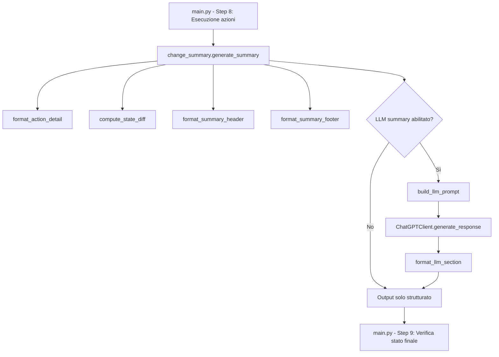

# Design: Network Change Summary

## Panoramica

Questa feature introduce un modulo `change_summary` che genera e visualizza un riepilogo strutturato delle modifiche di rete dopo ogni esecuzione di intent in `main.py`. Il modulo si inserisce nel flusso esistente tra lo Step 8 (esecuzione azioni) e lo Step 9 (verifica stato finale), senza alterare la logica corrente.

Il riepilogo include:
- Dettaglio per ogni azione eseguita (tipo, target, parametri, stato, durata)
- Indicazione della modalità di generazione (rule-based vs LLM) con confidence
- Diff dello stato di rete prima/dopo (quando disponibile)
- Riepilogo in linguaggio naturale tramite LLM (opzionale)

## Architettura

Il modulo si compone di funzioni pure per la formattazione e il calcolo del diff, più una funzione di orchestrazione che coordina la generazione del riepilogo completo.



Il modulo viene importato in `main.py` e invocato con una singola chiamata dopo il ciclo di esecuzione delle azioni.

## Componenti e Interfacce

### Modulo `llm_integration_module/services/change_summary.py`

Contiene tutte le funzioni per la generazione del riepilogo.

#### Funzioni principali

```python
def format_action_detail(
    action: NetworkAction,
    result: ExecutionResult
) -> str:
    """
    Formatta il dettaglio di una singola azione eseguita.
    Include tipo, target, parametri (se successo) o errore (se fallimento),
    stato con icona (✓/✗) e durata.
    """

def compute_state_diff(
    state_before: Optional[Dict],
    state_after: Optional[Dict]
) -> Optional[str]:
    """
    Calcola e formatta le differenze tra due stati di rete.
    Ritorna None se uno dei due stati è assente.
    Identifica chiavi aggiunte, rimosse e modificate.
    """

def format_summary_header(
    intent_text: str,
    confidence: float,
    threshold: float = 0.8
) -> str:
    """
    Formatta l'intestazione del riepilogo con intent originale,
    modalità di generazione (rule-based/LLM) e confidence.
    """

def format_summary_footer(
    results: List[ExecutionResult]
) -> str:
    """
    Formatta il riepilogo finale con conteggio successi/fallimenti
    e percentuale di successo.
    """

def build_llm_prompt(
    intent_text: str,
    actions: List[NetworkAction],
    results: List[ExecutionResult]
) -> str:
    """
    Costruisce il prompt da inviare al ChatGPTClient contenente
    l'intent originale, le azioni eseguite e i risultati.
    """

async def generate_llm_summary(
    chatgpt_client: ChatGPTClient,
    intent_text: str,
    actions: List[NetworkAction],
    results: List[ExecutionResult]
) -> Optional[str]:
    """
    Genera il riepilogo in linguaggio naturale tramite LLM.
    Ritorna None se il client non è disponibile o genera errore.
    Non lancia eccezioni.
    """

def generate_summary(
    intent_text: str,
    confidence: float,
    actions: List[NetworkAction],
    results: List[ExecutionResult],
    llm_summary: Optional[str] = None,
    threshold: float = 0.8
) -> str:
    """
    Funzione principale di orchestrazione.
    Genera il riepilogo completo combinando header, dettagli azioni,
    diff di stato, footer e opzionalmente il riepilogo LLM.
    """
```

### Integrazione in `main.py`

Dopo lo Step 8 (esecuzione azioni) e prima dello Step 9 (verifica stato finale):

```python
from src.services.change_summary import generate_summary, generate_llm_summary

# ... dopo il ciclo di esecuzione delle azioni ...

# Step 8.5: Riepilogo modifiche
try:
    llm_summary_text = None
    if os.environ.get("ENABLE_LLM_SUMMARY", "").lower() == "true":
        llm_summary_text = asyncio.run(
            generate_llm_summary(chatgpt_client, intent_text, 
                                 action_sequence.actions, results)
        )
    
    summary = generate_summary(
        intent_text=intent_text,
        confidence=intent_obj.confidence,
        actions=action_sequence.actions,
        results=results,
        llm_summary=llm_summary_text
    )
    print(summary)
except Exception as e:
    logger.error(f"Errore nella generazione del riepilogo: {e}")
```

L'opzione di riepilogo LLM è controllata dalla variabile d'ambiente `ENABLE_LLM_SUMMARY=true`.

## Modelli Dati

Il modulo non introduce nuovi modelli dati. Utilizza le strutture esistenti:

| Struttura | Modulo | Campi utilizzati |
|-----------|--------|-----------------|
| `NetworkAction` (LLM) | `llm_integration_module/models/actions.py` | `id`, `type`, `target`, `parameters`, `description`, `priority` |
| `ExecutionResult` | `northbound_script_generator/action_processor.py` | `action_id`, `status`, `duration`, `error`, `network_state_before`, `network_state_after` |
| `ExecutionStatus` | `northbound_script_generator/action_processor.py` | `SUCCESS`, `FAILED`, `TIMEOUT` |
| `ChatGPTResponse` | `llm_integration_module/services/chatgpt_client.py` | `content` |

### Struttura dell'output formattato

```
════════════════════════════════════════════════════════════
  RIEPILOGO MODIFICHE DI RETE
  Intent: "block traffic from h1 to h2"
  Modalità: Rule-based (confidence: 0.95)
════════════════════════════════════════════════════════════

  ✓ Azione 1: flow_mod su sw1 (0.45s)
    Parametri:
      operation: add
      match: {nw_src: 10.0.0.1, nw_dst: 10.0.0.2}
      actions: []
      cookie: 8192

  ✗ Azione 2: config_change su sw2 (1.20s)
    Errore: Connection timeout

── Diff stato di rete ──────────────────────────────────────
  + flows.sw1.rule_count: 5 → 6
  ~ flows.sw1.byte_count: 1024 → 2048
  - flows.sw2.temp_rule: (rimosso)

════════════════════════════════════════════════════════════
  RISULTATO: 1/2 azioni completate (50.0%)
  Successi: 1 | Fallimenti: 1
════════════════════════════════════════════════════════════

── Riepilogo LLM ───────────────────────────────────────────
  È stata aggiunta una regola di blocco del traffico tra h1
  e h2 sullo switch sw1. L'azione su sw2 è fallita per un
  timeout di connessione.
────────────────────────────────────────────────────────────
```


## Proprietà di Correttezza

*Una proprietà è una caratteristica o un comportamento che deve valere in tutte le esecuzioni valide di un sistema — essenzialmente, un'affermazione formale su ciò che il sistema deve fare. Le proprietà fungono da ponte tra specifiche leggibili dall'uomo e garanzie di correttezza verificabili dalla macchina.*

### Proprietà 1: Completezza del riepilogo per azione

*Per qualsiasi* lista di coppie (NetworkAction, ExecutionResult), il riepilogo generato deve contenere, per ogni azione: il tipo di azione, il target e la durata. Se lo stato è SUCCESS, deve contenere i valori dei parametri della NetworkAction. Se lo stato è FAILED, deve contenere il messaggio di errore dell'ExecutionResult.

**Valida: Requisiti 1.1, 1.2, 1.3**

### Proprietà 2: Modalità e confidence nel riepilogo

*Per qualsiasi* valore di confidence tra 0.0 e 1.0, il riepilogo deve indicare "Rule-based" se la confidence è >= 0.8, oppure "LLM" se < 0.8, e deve contenere il valore numerico della confidence.

**Valida: Requisito 1.4**

### Proprietà 3: Correttezza del diff di stato di rete

*Per qualsiasi* coppia di dizionari (state_before, state_after), il diff calcolato deve riportare correttamente tutte le chiavi aggiunte, rimosse e modificate. Se uno dei due stati è None, il diff non deve essere presente nell'output e la funzione non deve generare errori.

**Valida: Requisiti 2.1, 2.2**

### Proprietà 4: Completezza del prompt LLM

*Per qualsiasi* combinazione di intent, lista di azioni e lista di risultati, il prompt generato per il ChatGPTClient deve contenere il testo dell'intent originale, il tipo e target di ogni azione, e lo stato di ogni risultato di esecuzione.

**Valida: Requisito 3.4**

### Proprietà 5: Formattazione e conteggio corretti

*Per qualsiasi* lista di ExecutionResult, il riepilogo finale deve contenere separatori visivi, icone di stato (✓ per successo, ✗ per fallimento) per ogni azione, e un conteggio di successi e fallimenti che corrisponde esattamente al numero di risultati con status SUCCESS e FAILED nella lista di input.

**Valida: Requisiti 4.1, 4.2**

### Proprietà 6: Resilienza a input malformati

*Per qualsiasi* input (inclusi valori None, liste vuote, parametri mancanti), la funzione `generate_summary` non deve lanciare eccezioni non gestite e deve produrre un output stringa valido o registrare l'errore nel log.

**Valida: Requisito 5.3**

## Gestione Errori

| Scenario | Comportamento |
|----------|--------------|
| `ChatGPTClient` non disponibile | Log warning, riepilogo strutturato mostrato normalmente |
| `ChatGPTClient` restituisce errore | Log warning con dettaglio errore, riepilogo strutturato mostrato normalmente |
| `network_state_before` o `network_state_after` è None | Sezione diff omessa, resto del riepilogo invariato |
| Eccezione interna nel modulo `change_summary` | Log error, flusso di `main.py` continua normalmente |
| Lista azioni vuota | Riepilogo con header e footer, nessun dettaglio azione |
| Parametri azione malformati | Parametri mostrati come stringa raw, nessun crash |

La strategia generale è: il riepilogo non deve mai interrompere il flusso principale. Ogni errore viene catturato, loggato, e il sistema prosegue.

## Strategia di Testing

### Test unitari (example-based)

- Verifica che il riepilogo LLM appaia in una sezione separata dopo il riepilogo strutturato (Requisito 4.3)
- Verifica che `generate_llm_summary` ritorni None quando il ChatGPTClient lancia eccezione (Requisito 3.3)
- Verifica che il riepilogo funzioni sia in modalità rule-based che LLM con esempi concreti (Requisito 5.2)
- Verifica integrazione: `generate_llm_summary` chiama il ChatGPTClient con i dati corretti (Requisito 3.1)

### Test property-based (Hypothesis)

Ogni proprietà di correttezza viene implementata come test property-based con minimo 100 iterazioni.

- Libreria: **Hypothesis** (già presente nel progetto)
- Configurazione: `@settings(max_examples=100)`
- Tag: commento con `Feature: network-change-summary, Property N: <titolo>`
- Posizione: `tests/property/test_change_summary_properties.py`

Le proprietà 1-6 definite sopra vengono testate con generatori Hypothesis per:
- `NetworkAction` con tipi, target e parametri casuali
- `ExecutionResult` con stati casuali (SUCCESS/FAILED), durate, errori e stati di rete opzionali
- Valori di confidence tra 0.0 e 1.0
- Dizionari di stato di rete con chiavi e valori casuali
- Testi di intent casuali

### Test di integrazione

- Verifica che il riepilogo venga invocato nel punto corretto del flusso di `main.py` (Requisito 5.1)
- Verifica end-to-end con mock del ChatGPTClient per il riepilogo LLM (Requisito 3.1, 3.2)
