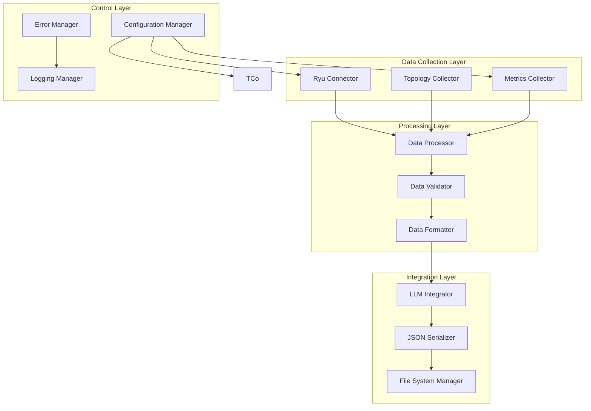

# Documento di Design

## Panoramica

Il Network State Collector è un sistema modulare e robusto progettato per raccogliere, elaborare e fornire dati di stato della rete in tempo reale per l'integrazione con modelli LLM. Il sistema si basa sull'architettura esistente ma introduce significativi miglioramenti in termini di affidabilità, estensibilità e integrazione con i modelli di machine learning del team.

Il design segue i principi di separazione delle responsabilità, con componenti distinti per la raccolta dati, l'elaborazione, la validazione e la serializzazione. Questo approccio garantisce manutenibilità e facilita l'integrazione con il repository LLM del team (github.com/andreapedrini01/llm-driven-net).

## Architettura

Il sistema è organizzato in quattro layer principali:



### Data Collection Layer
- **Ryu Connector**: Gestisce la connessione e le richieste HTTP al controller Ryu
- **Topology Collector**: Raccoglie dati di topologia (switch e link)
- **Metrics Collector**: Raccoglie statistiche delle prestazioni delle porte

### Processing Layer
- **Data Processor**: Elabora e trasforma i dati grezzi in strutture standardizzate
- **Data Validator**: Valida l'integrità e la consistenza dei dati
- **Data Formatter**: Formatta i dati per l'integrazione con LLM

### Integration Layer
- **LLM Integrator**: Prepara i dati nel formato ottimale per i modelli LLM
- **JSON Serializer**: Gestisce la serializzazione/deserializzazione JSON
- **File System Manager**: Gestisce il salvataggio e l'organizzazione dei file

### Control Layer
- **Configuration Manager**: Gestisce la configurazione del sistema
- **Error Manager**: Gestisce errori e retry logic
- **Logging Manager**: Gestisce logging e monitoraggio

## Componenti e Interfacce

### NetworkStateCollector (Classe Principale)

```python
class NetworkStateCollector:
    def __init__(self, config: CollectorConfig)
    def collect_snapshot(self) -> NetworkSnapshot
    def start_continuous_collection(self, interval: int)
    def stop_collection(self)
    def get_health_status(self) -> HealthStatus
```

### RyuConnector

```python
class RyuConnector:
    def __init__(self, base_url: str, timeout: int, retry_config: RetryConfig)
    def get_switches(self) -> List[Switch]
    def get_links(self) -> List[Link]
    def get_port_stats(self, dpid: str) -> List[PortStats]
    def is_healthy(self) -> bool
```

### DataProcessor

```python
class DataProcessor:
    def process_topology(self, switches: List[Switch], links: List[Link]) -> TopologyData
    def process_metrics(self, port_stats: Dict[str, List[PortStats]]) -> MetricsData
    def calculate_derived_metrics(self, metrics: MetricsData) -> DerivedMetrics
```

### LLMIntegrator

```python
class LLMIntegrator:
    def format_for_llm(self, snapshot: NetworkSnapshot) -> LLMNetworkData
    def create_context_embedding(self, data: LLMNetworkData) -> ContextEmbedding
    def validate_llm_schema(self, data: LLMNetworkData) -> ValidationResult
```

### ConfigurationManager

```python
class ConfigurationManager:
    def load_config(self, config_path: str) -> CollectorConfig
    def validate_config(self, config: CollectorConfig) -> ValidationResult
    def get_ryu_endpoint(self) -> str
    def get_output_directory(self) -> Path
    def get_collection_interval(self) -> int
```

## Modelli Dati

### NetworkSnapshot

```python
@dataclass
class NetworkSnapshot:
    timestamp: float
    topology: TopologyData
    metrics: MetricsData
    derived_metrics: DerivedMetrics
    metadata: SnapshotMetadata
```

### TopologyData

```python
@dataclass
class TopologyData:
    switches: List[SwitchInfo]
    links: List[LinkInfo]
    graph_representation: Dict[str, Any]
```

### MetricsData

```python
@dataclass
class MetricsData:
    port_statistics: Dict[str, List[PortMetrics]]
    aggregated_metrics: Dict[str, AggregatedMetrics]
    quality_indicators: QualityMetrics
```

### LLMNetworkData

```python
@dataclass
class LLMNetworkData:
    network_context: Dict[str, Any]
    performance_vectors: List[List[float]]
    topology_embedding: Dict[str, Any]
    temporal_features: Dict[str, Any]
    anomaly_indicators: List[AnomalyIndicator]
```

## Miglioramenti Rispetto al Codice Esistente

### 1. Gestione Errori Robusta
- Implementazione di retry logic con backoff esponenziale
- Gestione graceful dei timeout e delle disconnessioni
- Validazione dei dati ricevuti prima dell'elaborazione
- Logging strutturato per debugging e monitoraggio

### 2. Configurabilità Avanzata
- File di configurazione YAML/JSON per tutti i parametri
- Supporto per ambienti multipli (development, staging, production)
- Configurazione dinamica senza restart del servizio
- Validazione della configurazione all'avvio

### 3. Integrazione LLM Ottimizzata
- Schema JSON standardizzato per i modelli LLM
- Embedding dei dati di topologia per l'analisi grafica
- Calcolo di metriche derivate per l'anomaly detection
- Formato compatibile con il repository del team

### 4. Monitoraggio e Osservabilità
- Metriche di health check del collector
- Indicatori di qualità dei dati raccolti
- Logging strutturato con livelli configurabili
- Esportazione di metriche per sistemi di monitoring esterni

### 5. Estensibilità
- Architettura plugin per nuovi tipi di metriche
- Supporto per adapter verso altri controller SDN
- Interfacce standardizzate per l'integrazione con diversi LLM
- Possibilità di aggiungere trasformazioni dati personalizzate

## Integrazione con Repository LLM

Il sistema è progettato per integrarsi perfettamente con il repository github.com/andreapedrini01/llm-driven-net:

### Schema Dati Compatibile
```json
{
  "timestamp": 1640995200.0,
  "network_context": {
    "topology": {
      "nodes": ["switch1", "switch2"],
      "edges": [{"src": "switch1", "dst": "switch2", "port_out": 1, "port_in": 2}]
    },
    "performance": {
      "utilization_vectors": [[0.1, 0.2], [0.3, 0.4]],
      "error_rates": [0.001, 0.002],
      "congestion_indicators": [false, true]
    }
  },
  "llm_features": {
    "topology_embedding": {...},
    "temporal_patterns": {...},
    "anomaly_scores": [...]
  }
}
```

### Directory Structure per LLM
```
data/
├── network_context_latest.json      # Snapshot più recente
├── network_context_history/         # Storico per training
│   ├── 2024-01-01_network_state.json
│   └── 2024-01-02_network_state.json
├── embeddings/                      # Embedding pre-calcolati
│   ├── topology_embeddings.json
│   └── performance_embeddings.json
└── metadata/                        # Metadati per LLM
    ├── schema_version.json
    └── data_quality_report.json
```

### API per Modelli LLM
```python
class LLMDataProvider:
    def get_latest_context(self) -> LLMNetworkData
    def get_historical_data(self, start_time: float, end_time: float) -> List[LLMNetworkData]
    def get_topology_embedding(self) -> TopologyEmbedding
    def get_anomaly_candidates(self, threshold: float) -> List[AnomalyCandidate]
```
## Proprietà di Correttezza

*Una proprietà è una caratteristica o comportamento che dovrebbe essere vero in tutte le esecuzioni valide di un sistema - essenzialmente, una dichiarazione formale su ciò che il sistema dovrebbe fare. Le proprietà servono come ponte tra le specifiche leggibili dall'uomo e le garanzie di correttezza verificabili dalla macchina.*

### Proprietà 1: Raccolta Completa della Topologia
*Per qualsiasi* stato del controller Ryu con switch attivi, la connessione dovrebbe restituire tutti gli switch e link disponibili con informazioni complete delle porte
**Valida: Requisiti 1.1, 1.2**

### Proprietà 2: Formattazione Consistente DPID
*Per qualsiasi* DPID ricevuto dal controller, la formattazione dovrebbe sempre produrre una stringa esadecimale di esattamente 16 caratteri
**Valida: Requisiti 1.3**

### Proprietà 3: Resilienza agli Errori di Connessione
*Per qualsiasi* errore di connessione, timeout o fallimento di rete, il sistema dovrebbe rimanere operativo, implementare retry con backoff esponenziale e continuare con i dati disponibili
**Valida: Requisiti 1.4, 5.1, 5.2**

### Proprietà 4: Conformità Schema JSON
*Per qualsiasi* dato di topologia o metrica raccolta, l'output dovrebbe essere JSON valido e conforme allo schema definito per l'integrazione LLM
**Valida: Requisiti 1.5, 3.1**

### Proprietà 5: Raccolta Completa Metriche Porte
*Per qualsiasi* porta attiva su uno switch, dovrebbero essere raccolte tutte le metriche richieste (RX/TX packets, errors, bytes) escludendo le porte LOCAL
**Valida: Requisiti 2.1, 2.2**

### Proprietà 6: Completezza Dati per Calcoli Derivati
*Per qualsiasi* set di metriche raccolte, dovrebbero essere presenti tutti i campi necessari per calcolare utilizzo, congestione e tasso di errore
**Valida: Requisiti 2.3**

### Proprietà 7: Associazione Temporale Consistente
*Per qualsiasi* metrica o snapshot generato, dovrebbe essere presente un timestamp valido e consistente per l'analisi temporale
**Valida: Requisiti 2.4, 3.2**

### Proprietà 8: Isolamento Errori per Switch
*Per qualsiasi* errore che si verifica durante la raccolta dati da uno switch, il sistema dovrebbe continuare a raccogliere dati dagli altri switch senza interruzioni
**Valida: Requisiti 2.5**

### Proprietà 9: Struttura Snapshot Completa
*Per qualsiasi* snapshot generato, dovrebbero essere presenti tutti i componenti richiesti: timestamp, topologia e metriche in una struttura unificata
**Valida: Requisiti 3.2**

### Proprietà 10: Gestione Directory Configurabile
*Per qualsiasi* configurazione di directory di output, i file dovrebbero essere salvati nella posizione corretta con nomi consistenti secondo il pattern definito
**Valida: Requisiti 3.3, 3.4**

### Proprietà 11: Raccolta Temporizzata
*Per qualsiasi* intervallo di raccolta configurato, il sistema dovrebbe raccogliere dati con la frequenza specificata e generare snapshot immediati per cambiamenti significativi di topologia
**Valida: Requisiti 4.1, 4.2**

### Proprietà 12: Mantenimento Storico
*Per qualsiasi* serie di raccolte dati, dovrebbe essere mantenuto uno storico delle metriche per l'analisi dei trend
**Valida: Requisiti 4.3**

### Proprietà 13: Validazione e Scarto Dati Malformati
*Per qualsiasi* dato malformato o inconsistente ricevuto, dovrebbe essere validato, scartato se non valido, e l'evento dovrebbe essere registrato senza causare crash del sistema
**Valida: Requisiti 5.3, 7.1, 7.3, 7.5**

### Proprietà 14: Logging Comprensivo Errori
*Per qualsiasi* errore che si verifica nel sistema, dovrebbe essere registrato nei log con informazioni descrittive per debugging e monitoraggio
**Valida: Requisiti 5.4, 8.5**

### Proprietà 15: Continuità Servizio durante Errori Critici
*Per qualsiasi* errore critico che si verifica, il servizio dovrebbe rimanere attivo e operativo
**Valida: Requisiti 5.5**

### Proprietà 16: Adattabilità Formato Output
*Per qualsiasi* configurazione di formato di output, i dati dovrebbero essere serializzati conformemente al formato richiesto per diversi consumer LLM
**Valida: Requisiti 6.3**

### Proprietà 17: Rilevamento e Gestione Anomalie
*Per qualsiasi* dato anomalo rilevato durante la raccolta, dovrebbe essere segnalato e gestito appropriatamente con correzioni quando possibile
**Valida: Requisiti 7.2**

### Proprietà 18: Generazione Metriche Qualità
*Per qualsiasi* raccolta dati effettuata, dovrebbero essere generate e fornite metriche di qualità dei dati per il monitoraggio
**Valida: Requisiti 7.4**

### Proprietà 19: Parsing Conforme API Ryu
*Per qualsiasi* JSON valido ricevuto dall'API Ryu, dovrebbe essere parsato correttamente secondo la specifica API
**Valida: Requisiti 8.1**

### Proprietà 20: Serializzazione JSON Consistente
*Per qualsiasi* dato serializzato per i modelli LLM, dovrebbe essere JSON valido con formattazione consistente
**Valida: Requisiti 8.2**

### Proprietà 21: Formattazione Pretty Print
*Per qualsiasi* oggetto Network_State, il pretty printer dovrebbe formattarlo in JSON valido e leggibile
**Valida: Requisiti 8.3**

### Proprietà 22: Round-trip Serializzazione
*Per qualsiasi* oggetto Network_State valido, il parsing seguito dalla serializzazione seguito dal parsing dovrebbe produrre un oggetto equivalente
**Valida: Requisiti 8.4**

## Gestione Errori

Il sistema implementa una strategia di gestione errori a più livelli:

### Livello Connessione
- Retry automatico con backoff esponenziale per errori di rete
- Timeout configurabili per le richieste HTTP
- Fallback graceful quando il controller non è disponibile
- Health check periodici per monitorare lo stato del controller

### Livello Dati
- Validazione rigorosa di tutti i dati ricevuti
- Scarto automatico di dati malformati o inconsistenti
- Logging dettagliato di tutti gli errori per debugging
- Continuazione dell'operazione anche in presenza di dati parziali

### Livello Sistema
- Isolamento degli errori per evitare propagazione
- Mantenimento dello stato operativo durante errori non critici
- Notifiche automatiche per errori che richiedono intervento
- Metriche di monitoraggio per osservabilità del sistema

## Strategia di Testing

Il sistema utilizza un approccio di testing duale che combina test unitari e test basati su proprietà:

### Test Unitari
- **Esempi specifici**: Validazione di casi d'uso concreti e scenari tipici
- **Casi limite**: Test di condizioni di errore e situazioni estreme
- **Integrazione**: Verifica dei punti di integrazione tra componenti
- **Mocking**: Simulazione del controller Ryu per test isolati

### Test Basati su Proprietà
- **Copertura universale**: Verifica delle proprietà su tutti gli input possibili
- **Generazione automatica**: Creazione automatica di dati di test randomizzati
- **Configurazione minima**: 100 iterazioni per test per garantire copertura adeguata
- **Tagging**: Ogni test referenzia la proprietà del design corrispondente

### Configurazione Testing
- **Libreria PBT**: Utilizzo di Hypothesis per Python per i test basati su proprietà
- **Framework**: pytest per l'orchestrazione dei test
- **Copertura**: Obiettivo di copertura del codice > 90%
- **CI/CD**: Integrazione nei pipeline di continuous integration

### Formato Tag Test
Ogni test basato su proprietà deve essere taggato con:
**Feature: network-state-collector, Property {numero}: {testo_proprietà}**

Esempio:
```python
@given(network_snapshots())
def test_round_trip_serialization(snapshot):
    """Feature: network-state-collector, Property 22: Round-trip Serializzazione"""
    serialized = json.dumps(snapshot.to_dict())
    parsed = NetworkSnapshot.from_dict(json.loads(serialized))
    assert snapshot == parsed
```

Questo approccio garantisce che ogni proprietà di correttezza sia verificata attraverso test automatizzati, mentre i test unitari forniscono validazione per scenari specifici e casi limite.