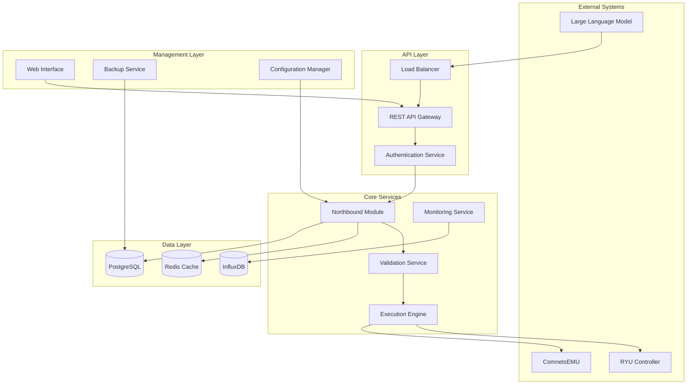

# Design Document: Northbound Script Generator

## Overview

Il Northbound Script Generator è un sistema distribuito e scalabile per la gestione di reti controllate da LLM. Il sistema riceve azioni di rete da Large Language Models tramite API REST, le valida, le applica alla rete ComnetsEMU/RYU e fornisce monitoraggio completo delle operazioni.

L'architettura è progettata per essere modulare, sicura e altamente disponibile, con capacità di auto-recovery e scalabilità orizzontale. Il sistema mantiene la compatibilità con l'implementazione esistente mentre aggiunge funzionalità enterprise-grade.

## Architecture

Il sistema segue un'architettura a microservizi con i seguenti componenti principali:



### Principi Architetturali

1. **Separation of Concerns**: Ogni servizio ha una responsabilità specifica e ben definita
2. **Fault Tolerance**: Ogni componente può gestire fallimenti dei servizi dipendenti
3. **Scalability**: Architettura stateless che permette scaling orizzontale
4. **Security by Design**: Autenticazione e autorizzazione integrate in ogni livello
5. **Observability**: Logging, metriche e tracing completi per ogni operazione

## Components and Interfaces

### REST API Gateway

**Responsabilità**: Punto di ingresso unificato per tutte le richieste esterne

**Interfacce**:
```python
class APIGateway:
    def handle_action_request(self, request: ActionRequest) -> ActionResponse
    def get_action_status(self, action_id: str) -> ActionStatus
    def list_actions(self, filters: ActionFilters) -> List[ActionSummary]
    def cancel_action(self, action_id: str) -> CancelResponse
    def get_health(self) -> HealthStatus
    def get_metrics(self) -> PrometheusMetrics
```

**Endpoints**:
- `POST /api/v1/actions` - Sottomissione nuove azioni
- `GET /api/v1/actions/{id}` - Status di un'azione specifica
- `GET /api/v1/actions` - Lista azioni con filtri
- `DELETE /api/v1/actions/{id}` - Cancellazione azione
- `GET /health` - Health check del sistema
- `GET /metrics` - Metriche Prometheus

### Authentication Service

**Responsabilità**: Gestione autenticazione, autorizzazione e sessioni

**Interfacce**:
```python
class AuthenticationService:
    def authenticate(self, credentials: Credentials) -> AuthToken
    def validate_token(self, token: str) -> TokenValidation
    def authorize(self, token: str, resource: str, action: str) -> bool
    def refresh_token(self, refresh_token: str) -> AuthToken
    def revoke_token(self, token: str) -> bool
    def enable_mfa(self, user_id: str, mfa_config: MFAConfig) -> bool
```

**Funzionalità**:
- Autenticazione JWT con refresh tokens
- Multi-Factor Authentication (TOTP)
- Role-Based Access Control (RBAC)
- Rate limiting per prevenire brute force
- Audit logging di tutti gli accessi

### Northbound Module (Core)

**Responsabilità**: Orchestrazione centrale delle operazioni di rete

**Interfacce**:
```python
class NorthboundModule:
    def process_action(self, action: NetworkAction) -> ActionResult
    def validate_action(self, action: NetworkAction) -> ValidationResult
    def execute_action(self, action: NetworkAction) -> ExecutionResult
    def rollback_action(self, action_id: str) -> RollbackResult
    def get_network_state(self) -> NetworkState
    def schedule_action(self, action: NetworkAction, schedule: Schedule) -> str
```

**Funzionalità**:
- Validazione semantica delle azioni di rete
- Orchestrazione dell'esecuzione con retry logic
- Gestione rollback automatico in caso di errori
- Scheduling di azioni future
- Mantenimento dello stato della rete

### Execution Engine

**Responsabilità**: Interfaccia diretta con ComnetsEMU e RYU Controller

**Interfacce**:
```python
class ExecutionEngine:
    def connect_to_ryu(self, config: RYUConfig) -> Connection
    def connect_to_comnets(self, config: ComnetsConfig) -> Connection
    def apply_flow_rule(self, rule: FlowRule) -> ExecutionResult
    def modify_topology(self, topology_change: TopologyChange) -> ExecutionResult
    def set_qos_policy(self, qos: QoSPolicy) -> ExecutionResult
    def get_network_topology(self) -> NetworkTopology
    def get_flow_statistics(self) -> FlowStatistics
```

**Funzionalità**:
- Connection pooling per RYU e ComnetsEMU
- Traduzione azioni high-level in comandi specifici
- Monitoraggio stato connessioni
- Recovery automatico da disconnessioni
- Caching intelligente dello stato di rete

### Monitoring Service

**Responsabilità**: Raccolta, aggregazione e alerting delle metriche di sistema

**Interfacce**:
```python
class MonitoringService:
    def collect_metrics(self) -> SystemMetrics
    def store_metrics(self, metrics: SystemMetrics) -> bool
    def check_alerts(self, metrics: SystemMetrics) -> List[Alert]
    def send_alert(self, alert: Alert) -> bool
    def get_dashboard_data(self, timerange: TimeRange) -> DashboardData
    def export_prometheus_metrics(self) -> str
```

**Metriche Raccolte**:
- Latenza e throughput delle API
- Utilizzo risorse (CPU, memoria, rete)
- Stato connessioni RYU/ComnetsEMU
- Tasso di successo/fallimento azioni
- Metriche di business (azioni per minuto, utenti attivi)

### Web Interface

**Responsabilità**: Dashboard web per visualizzazione e controllo del sistema

**Componenti**:
- Dashboard real-time con WebSocket
- Visualizzazione topologia di rete
- Log viewer con filtri avanzati
- Gestione utenti e permessi
- Configurazione sistema
- Monitoring e alerting

**Tecnologie**:
- Frontend: React con TypeScript
- Real-time: WebSocket + Server-Sent Events
- Visualizzazione: D3.js per topologie di rete
- State Management: Redux Toolkit
- UI Components: Material-UI

### Backup Service

**Responsabilità**: Backup automatico e recovery dei dati critici

**Interfacce**:
```python
class BackupService:
    def create_backup(self, backup_type: BackupType) -> BackupResult
    def restore_backup(self, backup_id: str) -> RestoreResult
    def list_backups(self, filters: BackupFilters) -> List[BackupInfo]
    def verify_backup(self, backup_id: str) -> VerificationResult
    def cleanup_old_backups(self) -> CleanupResult
    def schedule_backup(self, schedule: BackupSchedule) -> str
```

**Funzionalità**:
- Backup incrementali e completi
- Compressione e crittografia dei backup
- Verifica integrità automatica
- Retention policy configurabile
- Recovery point objective (RPO) < 1 ora

## Data Models

### Core Action Models

```python
from enum import Enum
from typing import Optional, Dict, Any, List
from datetime import datetime
from pydantic import BaseModel, Field

class ActionType(Enum):
    FLOW_RULE = "flow_rule"
    TOPOLOGY_CHANGE = "topology_change"
    QOS_POLICY = "qos_policy"
    NETWORK_CONFIG = "network_config"
    MONITORING_RULE = "monitoring_rule"

class ActionStatus(Enum):
    PENDING = "pending"
    VALIDATING = "validating"
    EXECUTING = "executing"
    COMPLETED = "completed"
    FAILED = "failed"
    CANCELLED = "cancelled"
    ROLLED_BACK = "rolled_back"

class NetworkAction(BaseModel):
    id: str = Field(..., description="Unique action identifier")
    type: ActionType = Field(..., description="Type of network action")
    parameters: Dict[str, Any] = Field(..., description="Action-specific parameters")
    priority: int = Field(default=5, ge=1, le=10, description="Execution priority (1=highest)")
    timeout_seconds: int = Field(default=300, ge=1, description="Maximum execution time")
    retry_count: int = Field(default=3, ge=0, description="Number of retry attempts")
    rollback_on_failure: bool = Field(default=True, description="Enable automatic rollback")
    created_at: datetime = Field(default_factory=datetime.utcnow)
    created_by: str = Field(..., description="User or system that created the action")
    metadata: Dict[str, Any] = Field(default_factory=dict, description="Additional metadata")

class FlowRule(BaseModel):
    switch_id: str = Field(..., description="Target switch identifier")
    table_id: int = Field(default=0, ge=0, description="Flow table ID")
    priority: int = Field(..., ge=0, le=65535, description="Rule priority")
    match_fields: Dict[str, Any] = Field(..., description="Packet matching criteria")
    actions: List[str] = Field(..., description="Actions to apply to matching packets")
    idle_timeout: int = Field(default=0, ge=0, description="Idle timeout in seconds")
    hard_timeout: int = Field(default=0, ge=0, description="Hard timeout in seconds")

class TopologyChange(BaseModel):
    operation: str = Field(..., regex="^(add|remove|modify)$", description="Operation type")
    element_type: str = Field(..., regex="^(switch|link|host)$", description="Network element type")
    element_id: str = Field(..., description="Element identifier")
    properties: Dict[str, Any] = Field(default_factory=dict, description="Element properties")

class QoSPolicy(BaseModel):
    policy_id: str = Field(..., description="QoS policy identifier")
    target_type: str = Field(..., regex="^(switch|port|flow)$", description="Target type")
    target_id: str = Field(..., description="Target identifier")
    bandwidth_limit: Optional[int] = Field(None, ge=0, description="Bandwidth limit in Mbps")
    latency_limit: Optional[int] = Field(None, ge=0, description="Latency limit in ms")
    packet_loss_limit: Optional[float] = Field(None, ge=0, le=1, description="Packet loss limit (0-1)")
    dscp_marking: Optional[int] = Field(None, ge=0, le=63, description="DSCP marking value")
```

### System State Models

```python
class NetworkState(BaseModel):
    topology: Dict[str, Any] = Field(..., description="Current network topology")
    flow_tables: Dict[str, List[FlowRule]] = Field(..., description="Active flow rules per switch")
    qos_policies: List[QoSPolicy] = Field(..., description="Active QoS policies")
    statistics: Dict[str, Any] = Field(..., description="Network statistics")
    last_updated: datetime = Field(default_factory=datetime.utcnow)

class ActionResult(BaseModel):
    action_id: str = Field(..., description="Action identifier")
    status: ActionStatus = Field(..., description="Execution status")
    result_data: Optional[Dict[str, Any]] = Field(None, description="Execution result data")
    error_message: Optional[str] = Field(None, description="Error message if failed")
    execution_time_ms: int = Field(..., ge=0, description="Execution time in milliseconds")
    rollback_info: Optional[Dict[str, Any]] = Field(None, description="Rollback information")
    created_at: datetime = Field(default_factory=datetime.utcnow)

class SystemMetrics(BaseModel):
    timestamp: datetime = Field(default_factory=datetime.utcnow)
    cpu_usage_percent: float = Field(..., ge=0, le=100)
    memory_usage_percent: float = Field(..., ge=0, le=100)
    network_io_bytes: Dict[str, int] = Field(..., description="Network I/O statistics")
    active_connections: int = Field(..., ge=0)
    actions_per_minute: int = Field(..., ge=0)
    error_rate_percent: float = Field(..., ge=0, le=100)
    response_time_p95_ms: float = Field(..., ge=0)
```

### Configuration Models

```python
class RYUConfig(BaseModel):
    host: str = Field(..., description="RYU controller host")
    port: int = Field(default=8080, ge=1, le=65535, description="RYU controller port")
    api_version: str = Field(default="v1.0", description="API version")
    timeout_seconds: int = Field(default=30, ge=1, description="Connection timeout")
    max_retries: int = Field(default=3, ge=0, description="Maximum retry attempts")
    ssl_enabled: bool = Field(default=False, description="Enable SSL/TLS")
    ssl_verify: bool = Field(default=True, description="Verify SSL certificates")

class ComnetsConfig(BaseModel):
    host: str = Field(..., description="ComnetsEMU host")
    port: int = Field(default=6653, ge=1, le=65535, description="ComnetsEMU port")
    protocol: str = Field(default="openflow", regex="^(openflow|netconf)$")
    version: str = Field(default="1.3", description="Protocol version")
    connection_pool_size: int = Field(default=10, ge=1, description="Connection pool size")

class MonitoringConfig(BaseModel):
    metrics_interval_seconds: int = Field(default=60, ge=1, description="Metrics collection interval")
    retention_days: int = Field(default=30, ge=1, description="Metrics retention period")
    alert_thresholds: Dict[str, float] = Field(..., description="Alert threshold values")
    prometheus_enabled: bool = Field(default=True, description="Enable Prometheus export")
    influxdb_config: Dict[str, Any] = Field(..., description="InfluxDB configuration")
```

## Correctness Properties

*Una proprietà è una caratteristica o comportamento che dovrebbe essere vero in tutte le esecuzioni valide di un sistema - essenzialmente, una dichiarazione formale su ciò che il sistema dovrebbe fare. Le proprietà servono come ponte tra le specifiche leggibili dall'uomo e le garanzie di correttezza verificabili dalla macchina.*

### Property 1: Elaborazione Completa delle Azioni di Rete
*Per qualsiasi* azione di rete valida ricevuta dal Northbound_Module, il sistema deve connettersi al RYU_Controller, applicare l'azione, verificare lo stato della rete e confermare l'applicazione con successo
**Validates: Requirements 1.1, 1.3**

### Property 2: Gestione Resiliente degli Errori di Connessione
*Per qualsiasi* errore di connessione con ComnetsEMU o RYU_Controller, il sistema deve registrare l'errore con dettagli completi e tentare automaticamente il rollback dell'azione
**Validates: Requirements 1.2**

### Property 3: Resilienza del Sistema con Controller Indisponibile
*Per qualsiasi* periodo di indisponibilità del RYU_Controller, il sistema deve mettere in coda tutte le azioni ricevute e riprovare automaticamente quando il controller torna disponibile
**Validates: Requirements 1.4**

### Property 4: Processamento Completo delle Richieste API
*Per qualsiasi* richiesta POST valida all'endpoint /api/actions, il sistema deve validare l'azione, processarla e restituire un ID di tracking univoco con lo stato corrente
**Validates: Requirements 2.1, 2.3**

### Property 5: Gestione Errori delle Richieste Malformate
*Per qualsiasi* richiesta malformata ricevuta dall'API, il sistema deve restituire un errore HTTP 400 con dettagli specifici dell'errore senza processare l'azione
**Validates: Requirements 2.2**

### Property 6: Raccolta Continua delle Metriche
*Per qualsiasi* periodo di esecuzione del sistema, il Monitoring_System deve raccogliere metriche di prestazione ogni secondo con precisione temporale ±100ms
**Validates: Requirements 3.1**

### Property 7: Generazione Automatica degli Alert
*Per qualsiasi* metrica che supera una soglia critica configurata, il sistema deve generare automaticamente un alert entro 5 secondi dalla rilevazione
**Validates: Requirements 3.2**

### Property 8: Controllo Completo di Autenticazione e Autorizzazione
*Per qualsiasi* tentativo di accesso al sistema, l'Authentication_System deve richiedere credenziali valide e verificare i permessi per ogni azione richiesta dall'utente autenticato
**Validates: Requirements 4.1, 4.3**

### Property 9: Blocco Account per Tentativi Falliti
*Per qualsiasi* account che fornisce credenziali errate per 3 volte consecutive, il sistema deve bloccare l'account per esattamente 15 minuti e registrare l'evento di sicurezza
**Validates: Requirements 4.2**

### Property 10: Visualizzazione Progress delle Azioni
*Per qualsiasi* azione in corso visualizzata nella Web_Interface, il sistema deve mostrare progress bar aggiornate in tempo reale e tempi stimati di completamento
**Validates: Requirements 5.2**

### Property 11: Sistema di Backup e Recovery Automatico
*Per qualsiasi* periodo di esecuzione del sistema, il Backup_System deve creare backup automatici ogni ora e tentare recovery automatico dall'ultimo backup valido in caso di guasto critico
**Validates: Requirements 6.1, 6.3**

### Property 12: Selezione Punti di Ripristino
*Per qualsiasi* richiesta di ripristino, il sistema deve permettere la selezione di un punto di ripristino specifico dalla lista dei backup disponibili e verificarne l'integrità prima del ripristino
**Validates: Requirements 6.2**

### Property 13: Performance dei Test Automatizzati
*Per qualsiasi* esecuzione della suite di test completa, il sistema deve validare tutte le funzionalità core in meno di 5 minuti e simulare scenari di rete realistici nei test di integrazione
**Validates: Requirements 7.1, 7.2**

### Property 14: Aggiornamento Automatico della Documentazione
*Per qualsiasi* nuova versione rilasciata del sistema, la documentazione API deve essere aggiornata automaticamente con esempi interattivi funzionanti per ogni endpoint
**Validates: Requirements 8.2**

### Property 15: Gestione Dinamica della Configurazione e Logging
*Per qualsiasi* modifica di configurazione compatibile, il sistema deve applicare le modifiche senza riavvio e registrare tutti gli eventi significativi con il livello di dettaglio appropriato
**Validates: Requirements 9.1, 9.2**

### Property 16: Mantenimento Performance sotto Carico
*Per qualsiasi* aumento del carico di sistema, il sistema deve mantenere tempi di risposta sotto i 100ms per il 95% delle richieste e supportare elaborazione parallela efficiente per azioni multiple
**Validates: Requirements 10.1, 10.2**

## Error Handling

Il sistema implementa una strategia di error handling a più livelli per garantire resilienza e affidabilità:

### Livelli di Error Handling

1. **Input Validation Layer**
   - Validazione sintattica e semantica di tutte le richieste
   - Sanitizzazione degli input per prevenire injection attacks
   - Rate limiting per prevenire abuse

2. **Business Logic Layer**
   - Validazione delle regole di business
   - Controllo delle precondizioni per ogni operazione
   - Gestione degli stati inconsistenti

3. **Infrastructure Layer**
   - Retry automatico con exponential backoff
   - Circuit breaker per servizi esterni
   - Fallback su servizi alternativi quando disponibili

4. **Data Layer**
   - Transazioni ACID per operazioni critiche
   - Backup automatico prima di operazioni distruttive
   - Verifica integrità dei dati

### Strategie di Recovery

**Automatic Rollback**: Ogni azione di rete include informazioni per il rollback automatico in caso di fallimento parziale.

**Graceful Degradation**: Il sistema continua a funzionare con funzionalità ridotte quando componenti non critici falliscono.

**Self-Healing**: Monitoraggio continuo e tentativo automatico di recovery per errori transitori.

**Circuit Breaker Pattern**: Protezione da cascading failures attraverso isolamento dei componenti falliti.

### Error Categories

```python
class ErrorCategory(Enum):
    VALIDATION_ERROR = "validation_error"      # Input non valido
    AUTHENTICATION_ERROR = "auth_error"        # Problemi di autenticazione
    AUTHORIZATION_ERROR = "authz_error"        # Problemi di autorizzazione
    NETWORK_ERROR = "network_error"            # Errori di connettività
    TIMEOUT_ERROR = "timeout_error"            # Timeout operazioni
    RESOURCE_ERROR = "resource_error"          # Risorse insufficienti
    BUSINESS_LOGIC_ERROR = "business_error"    # Violazione regole business
    SYSTEM_ERROR = "system_error"              # Errori di sistema
    EXTERNAL_SERVICE_ERROR = "external_error"  # Errori servizi esterni
```

## Testing Strategy

Il sistema implementa una strategia di testing duale che combina unit testing e property-based testing per garantire copertura completa e correttezza del sistema.

### Dual Testing Approach

**Unit Tests**: Verificano esempi specifici, casi limite e condizioni di errore
- Focus su scenari concreti e casi edge specifici
- Integrazione tra componenti
- Condizioni di errore e gestione eccezioni
- Validazione di comportamenti specifici dell'interfaccia utente

**Property Tests**: Verificano proprietà universali attraverso tutti gli input possibili
- Copertura completa degli input attraverso randomizzazione
- Validazione di invarianti del sistema
- Test di proprietà matematiche e logiche
- Verifica di comportamenti che devono valere per tutti i casi

### Property-Based Testing Configuration

**Framework**: Utilizzeremo Hypothesis per Python per i test property-based
- Minimo 100 iterazioni per ogni property test
- Ogni property test deve referenziare la sua proprietà del documento di design
- Tag format: **Feature: northbound-script-generator, Property {number}: {property_text}**

**Test Categories**:

1. **Invariant Properties**: Proprietà che rimangono costanti nonostante i cambiamenti
   - Stato della rete dopo operazioni di rollback
   - Integrità dei dati dopo backup/restore
   - Consistenza delle metriche raccolte

2. **Round Trip Properties**: Operazioni che combinate con la loro inversa ritornano al valore originale
   - Serializzazione/deserializzazione delle azioni di rete
   - Backup/restore dello stato del sistema
   - Encoding/decoding delle configurazioni

3. **Idempotence Properties**: Operazioni dove applicarle due volte equivale ad applicarle una volta
   - Applicazione di regole di flusso duplicate
   - Configurazione di policy QoS identiche
   - Creazione di backup con stesso timestamp

4. **Metamorphic Properties**: Relazioni che devono valere tra componenti
   - Numero di azioni processate ≤ numero di azioni ricevute
   - Tempo di esecuzione con retry ≥ tempo di esecuzione senza retry
   - Metriche aggregate ≥ metriche individuali

5. **Error Condition Properties**: Generazione di input non validi per verificare gestione errori
   - Azioni di rete con parametri non validi
   - Richieste API malformate
   - Configurazioni inconsistenti

### Unit Testing Balance

I unit test si concentrano su:
- **Esempi Specifici**: Dimostrazioni concrete di comportamento corretto
- **Punti di Integrazione**: Interfacce tra componenti diversi
- **Casi Limite**: Situazioni boundary e edge cases
- **Condizioni di Errore**: Scenari di fallimento specifici

I property test si concentrano su:
- **Proprietà Universali**: Regole che valgono per tutti gli input
- **Copertura Completa**: Validazione attraverso randomizzazione
- **Invarianti di Sistema**: Proprietà che non devono mai essere violate
- **Comportamenti Emergenti**: Proprietà che emergono dall'interazione dei componenti

### Test Implementation Requirements

Ogni proprietà di correttezza DEVE essere implementata da un SINGOLO property-based test che:
1. Genera input casuali appropriati per la proprietà
2. Esegue l'operazione sotto test
3. Verifica che la proprietà sia soddisfatta
4. Include il tag di riferimento alla proprietà del design
5. Esegue almeno 100 iterazioni per test

Esempio di implementazione:
```python
@given(network_action=network_action_strategy())
def test_complete_action_processing_property_1(network_action):
    """
    Feature: northbound-script-generator, Property 1: 
    Elaborazione Completa delle Azioni di Rete
    """
    # Test implementation here
    pass
```

### Continuous Integration

- Esecuzione automatica di tutti i test ad ogni commit
- Blocco automatico del deployment in caso di test falliti
- Reporting dettagliato dei risultati dei property test
- Analisi di coverage per identificare aree non testate
- Performance benchmarking per rilevare regressioni